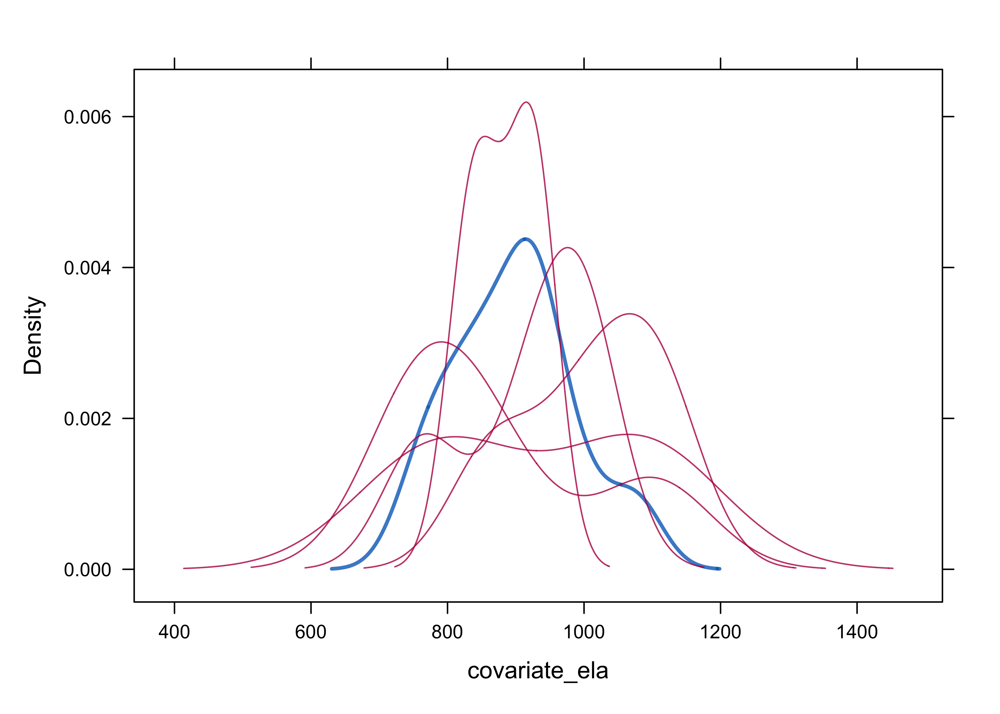

Annotated R Code: Culturally Relevant PjBL Dissertation
================

- [Random Assignment of Classes to Treatment
  Groups](#random-assignment-of-classes-to-treatment-groups)
- [Data Cleaning](#data-cleaning)
- [Missing Value Analysis](#missing-value-analysis)
  - [1. Overall missing value summary](#1-overall-missing-value-summary)
- [Multiple Imputation of Missing
  Values](#multiple-imputation-of-missing-values)
  - [Check data before imputation](#check-data-before-imputation)
  - [Set up imputation method](#set-up-imputation-method)
- [Assumption Checking](#assumption-checking)
  - [Study Design Assumptions](#study-design-assumptions)
  - [Assumptions in Live Data](#assumptions-in-live-data)
- [MANCOVA Analysis](#mancova-analysis)
  - [Planned Contrasts - Setup](#planned-contrasts---setup)
  - [Descriptive Statistics](#descriptive-statistics)
  - [Omnibus Test](#omnibus-test)
  - [Planned Contrasts](#planned-contrasts)

This appendix contains the R code used and output obtained during data
collection and analysis for this study. Appendix YY contains only the
raw R code without output.

``` r
# load libraries
library(readr)
library(ggplot2)
library(MVN)
library(GGally)
library(car)
library(biotools)
library(performance)
library(DescTools)
library(knitr)
library(kableExtra)
library(effectsize)
library(emmeans)
library(psych)
library(tidyr)
library(VIM)
library(mice)
library(naniar)
library(purrr)
library(Rmisc)
library(dplyr)
library(mitools)
library(heplots)
```

# Random Assignment of Classes to Treatment Groups

Before data collection, classes must be randomly assigned to treatment
groups. The code below will accomplish this task using the standard R
function “sample” which is used for sampling and random assignment.

``` r
# Load the classroom data into a data frame
classroom_data <- read.csv("classroom_data.csv", stringsAsFactors = FALSE)

# Split the data frame by grade level
grade6 <- classroom_data[classroom_data$grade == 6, ]
grade8 <- classroom_data[classroom_data$grade == 8, ]

# For grade 6
n_grade6 <- nrow(grade6)
# Randomly decide if group A or B gets the extra classroom when odd
if (n_grade6 %% 2 == 1) {
  extra_to_a <- sample(c(TRUE, FALSE), 1)
  n_group_a_grade6 <- floor(n_grade6 / 2) + ifelse(extra_to_a, 1, 0)
  n_group_b_grade6 <- floor(n_grade6 / 2) + ifelse(extra_to_a, 0, 1)
} else {
  n_group_a_grade6 <- n_grade6 / 2
  n_group_b_grade6 <- n_grade6 / 2
}
grade6$group <- c(rep("A", n_group_a_grade6), rep("B", n_group_b_grade6))
grade6$group <- sample(grade6$group)  # Randomize the assignments

# For grade 8
n_grade8 <- nrow(grade8)
# Randomly decide if group A or B gets the extra classroom when odd
if (n_grade8 %% 2 == 1) {
  extra_to_a <- sample(c(TRUE, FALSE), 1)
  n_group_a_grade8 <- floor(n_grade8 / 2) + ifelse(extra_to_a, 1, 0)
  n_group_b_grade8 <- floor(n_grade8 / 2) + ifelse(extra_to_a, 0, 1)
} else {
  n_group_a_grade8 <- n_grade8 / 2
  n_group_b_grade8 <- n_grade8 / 2
}
grade8$group <- c(rep("A", n_group_a_grade8), rep("B", n_group_b_grade8))
grade8$group <- sample(grade8$group)  # Randomize the assignments

# Recombine the data
classroom_data <- rbind(grade6, grade8)

# Export the final data frame to a new CSV file
write.csv(classroom_data, "classroom_data_with_groups.csv", row.names = FALSE)
```

# Data Cleaning

First, raw data is loaded into a data frame. Group membership, grade
level, gender, and race/ethnicity are loaded as factors since that is
needed for subsequent analyses.

``` r
# load data frame
raw_pbl_study_data <- read_csv('scd-s_responses.csv',
                           na = c("NA", " ", ""),
                           col_types = cols(
                               group = col_character(),
                               grade_reported = col_factor(),
                               gender = col_factor(),
                               race_reported = col_factor(),
                               race = col_factor(),
                               .default = col_double()
                           ))

# Convert group to a factor
raw_pbl_study_data$group <- as.factor(raw_pbl_study_data$group)

# Convert participant_id to text instead of number
raw_pbl_study_data$participant_id <- as.character(raw_pbl_study_data$participant_id)
```

Next, group codes are swapped for words.

``` r
raw_pbl_study_data$group <- factor(raw_pbl_study_data$group,
                            levels = c("A", "B", "C"),
                            labels = c("CR-PBL", "S-PBL", "Control"))
```

Gender terms (entered as “Boy”, “Girl”, or “Other”) are made consistent
with standard terminology.

``` r
raw_pbl_study_data$gender <- factor(raw_pbl_study_data$gender,
                            levels = c("Boy", "Girl", "Other"),
                            labels = c("Male", "Female", "Other"))
```

Grade levels are converted to numbers. One student reported “Grade 7”
but was confirmed to be a 6th grade student, so “Grade 7” is converted
to “6”.

``` r
raw_pbl_study_data$grade <- with(raw_pbl_study_data, case_when(
        grade_reported == "Grade 6" ~ "6",
        grade_reported == "Grade 7" ~ "6",
        grade_reported == "Grade 8" ~ "8"
    )) |> as.factor()
```

Now the factor levels are defined to establish the correct reference
level and order. For group membership, the Control group will be the
reference.

``` r
# Modify factor levels to establish reference level and order
raw_pbl_study_data <- raw_pbl_study_data |> mutate(
        group = factor(group, levels = c("Control", "S-PBL", "CR-PBL")),
        grade = factor(grade, levels = c("6", "8")),
        gender = factor(gender, levels = sort(as.character(unique(gender)))),
        race = factor(race, levels = sort(as.character(unique(race))))
    )
```

Next we compute subscales from the individual item responses.

``` r
# Compute SCD-S Subscales from individual items. Since each survey item label begins with the subscale code, R can search for and add all items that start with the same code.

raw_pbl_study_data <- raw_pbl_study_data |>
  mutate(
    QI = rowSums(across(starts_with("QI_"))),
    PCC = rowSums(across(starts_with("PCC_"))),
    CuSo = rowSums(across(starts_with("CuSo_"))),
    CrCs = rowSums(across(starts_with("CrCs_")))
  )
```

We keep the original data pristine and copy it to a new frame with new
names for the manipulation and data analysis. The renamed fields will be
easier to understand in the analysis code.

``` r
# Rename the variables for convenience of reference
school_climate_data <- raw_pbl_study_data |> rename(
    covariate_ela = PSSA,
    dv1_qual_interaction = QI,
    dv2_prom_cult_competence = PCC,
    dv3_cult_soc = CuSo,
    dv4_crit_con_soc = CrCs
)
```

Next we will remove all columns that are not part of the analysis, since
duplicate and correlated data will affect a number of processes later.

``` r
analysis_vars <- c("participant_id", "group", "grade", "gender", "race", 
                   "covariate_ela", "dv1_qual_interaction", "dv2_prom_cult_competence", 
                   "dv3_cult_soc", "dv4_crit_con_soc")

school_climate_data <- school_climate_data[analysis_vars]
```

# Missing Value Analysis

## 1. Overall missing value summary

Check missing patterns

``` r
missing_pattern <- md.pattern(school_climate_data[, c("covariate_ela", 
                                                      "dv1_qual_interaction",
                                                      "dv2_prom_cult_competence", 
                                                      "dv3_cult_soc", 
                                                      "dv4_crit_con_soc")])
```

<!-- -->

Check if missingness is related to treatment group

``` r
missing_by_group <- school_climate_data |>
  group_by(group) |>
  summarise(
    n = n(),
    missing_ela = sum(is.na(covariate_ela)),
    pct_missing_ela = (missing_ela/n)*100,
    missing_dv1 = sum(is.na(dv1_qual_interaction)),
    pct_missing_dv1 = (missing_dv1/n)*100,
    .groups = 'drop'
  )

print("Missing values by treatment group:")
```

    ## [1] "Missing values by treatment group:"

``` r
print(missing_by_group)
```

    ## # A tibble: 3 × 6
    ##   group       n missing_ela pct_missing_ela missing_dv1 pct_missing_dv1
    ##   <fct>   <int>       <int>           <dbl>       <int>           <dbl>
    ## 1 Control    26           4            15.4           0               0
    ## 2 S-PBL      26           0             0             0               0
    ## 3 CR-PBL     34           0             0             0               0

Test if missingness is related to treatment (MCAR test)

``` r
mcar_test_result <- mcar_test(school_climate_data[, c("group", "covariate_ela", 
                                                      "dv1_qual_interaction",
                                                      "dv2_prom_cult_competence", 
                                                      "dv3_cult_soc", 
                                                      "dv4_crit_con_soc")])
print(mcar_test_result)
```

    ## # A tibble: 1 × 4
    ##   statistic    df p.value missing.patterns
    ##       <dbl> <dbl>   <dbl>            <int>
    ## 1      8.36     5   0.138                2

Although the MCAR test is not significant, we know that all missing
covariate values are in the Control group, thus we are treating the
missing data as Missing At Random (MAR) rather than Missing Completely
At Random (MCAR). Since the default predictor matrix in the mice package
already accounts for group, we can proceed with multiple imputation.

# Multiple Imputation of Missing Values

## Check data before imputation

``` r
print("Data summary before imputation:")
```

    ## [1] "Data summary before imputation:"

``` r
print(summary(school_climate_data[, c("covariate_ela", 
                                      "dv1_qual_interaction",
                                      "dv2_prom_cult_competence", 
                                      "dv3_cult_soc", 
                                      "dv4_crit_con_soc")]))
```

    ##  covariate_ela  dv1_qual_interaction dv2_prom_cult_competence  dv3_cult_soc  
    ##  Min.   : 745   Min.   : 5.00        Min.   : 7.00            Min.   : 3.00  
    ##  1st Qu.: 981   1st Qu.:12.00        1st Qu.:24.00            1st Qu.: 8.00  
    ##  Median :1103   Median :13.00        Median :26.50            Median :11.00  
    ##  Mean   :1062   Mean   :12.81        Mean   :25.64            Mean   :10.31  
    ##  3rd Qu.:1158   3rd Qu.:15.00        3rd Qu.:29.00            3rd Qu.:13.00  
    ##  Max.   :1293   Max.   :15.00        Max.   :30.00            Max.   :15.00  
    ##  NA's   :4                                                                   
    ##  dv4_crit_con_soc
    ##  Min.   : 5.00   
    ##  1st Qu.:13.00   
    ##  Median :16.00   
    ##  Mean   :15.66   
    ##  3rd Qu.:18.00   
    ##  Max.   :20.00   
    ## 

## Set up imputation method

Since only one continuous variable (the covariate) has missing values,
predictive mean matching is the proper method. This is the default in
the mice package and so it will not be specified.

Perform multiple imputation:

``` r
set.seed(123)  # For reproducibility
imputed_data <- mice(school_climate_data, 
                     m = 5,  # Number of imputations; 5 is commonly recommended when a small percentage of data is missing
                     maxit = 50,  # Number of iterations
                     printFlag = FALSE)
```

    ## Warning: Number of logged events: 1

``` r
# display any logged events in case there are issues
imputed_data$loggedEvents
```

    ##   it im dep     meth            out
    ## 1  0  0     constant participant_id

Check convergence

``` r
plot(imputed_data, c("covariate_ela"))
```

<!-- -->

Check quality of imputations

``` r
# Density plot of the entire dataset
densityplot(imputed_data, ~ covariate_ela)
```

<!-- -->

``` r
# Density plot of just the Control group, since that is where all missing data occurred
densityplot(imputed_data, ~ covariate_ela, subset = group == "Control")
```

<!-- -->

Create a list of complete datasets. All further analysis will be done
with all five imputed data sets and results will be compared or pooled.
When all imputed datasets agree,

``` r
imputed_climate_data <- complete(imputed_data, action = "all")
```

# Assumption Checking

We need to check 11 assumptions for a MANCOVA analysis. This study meets
the four assumptions related to the types of variables:

## Study Design Assumptions

1.  There are four dependent variables measured continuously via the
    rating scores on the SDC-S.
2.  The categorical independent variable is the type of PjBL treatment,
    and all groups are independent of each other with no participants
    being members of more than one group.
3.  Prior ELA achievement is the single covariate, measured continuously
    using the score from the PSSA ELA test.
4.  All observations are independent because all participants are
    members of one and only one of the treatment groups.

## Assumptions in Live Data

The remaining assumptions must be checked with our data set:

### Linear Relationships

5.  There should be a linear relationship between each pair of dependent
    variables within each group of the independent variable, and
6.  There should be a linear relationship between the covariate and each
    dependent variable within each group of the independent variable.

We can check assumptions 5 and 6 by creating scatterplots with LOESS
lines. For this test, we will only use the first imputed dataset since
linearity will be very similar across all imputed datasets:

``` r
# Use the first imputed dataset for linearity checks
first_imputed <- imputed_climate_data[[1]]

# Data with grade, gender, and race removed; includes group, covariate and all dependent variables
numeric_data <- first_imputed[, c(
    "group",
    "covariate_ela",
    "dv1_qual_interaction",
    "dv2_prom_cult_competence",
    "dv3_cult_soc",
    "dv4_crit_con_soc"
)]

# Create subgroups with only the data for one group
crpbl_data <- numeric_data |> filter(group == "CR-PBL") |> select(-group)  # removes group column
spbl_data <- numeric_data |> filter(group == "S-PBL") |> select(-group)
control_data <- numeric_data |> filter(group == "Control") |> select(-group)

# Create pairs plot with smoothed lines in lower triangle
pairs(crpbl_data,
     upper.panel = NULL,  # Blank upper panel
     diag.panel = NULL,   # Blank diagonal
     lower.panel = function(x, y, ...) {
       points(x, y, col = rgb(0,0,0,0.5), pch = 16, cex = 0.6)
       lines(lowess(x, y, f = 0.8), col = "black", lwd = 2)
     })
```

<!-- -->

``` r
pairs(spbl_data,
     upper.panel = NULL,  # Blank upper panel
     diag.panel = NULL,   # Blank diagonal
     lower.panel = function(x, y, ...) {
       points(x, y, col = rgb(0,0,0,0.5), pch = 16, cex = 0.6)
       lines(lowess(x, y, f = 0.8), col = "black", lwd = 2)
     })
```

<!-- -->

``` r
pairs(control_data,
     upper.panel = NULL,  # Blank upper panel
     diag.panel = NULL,   # Blank diagonal
     lower.panel = function(x, y, ...) {
       points(x, y, col = rgb(0,0,0,0.5), pch = 16, cex = 0.6)
       lines(lowess(x, y, f = 0.8), col = "black", lwd = 2)
     })
```

<!-- -->

#### Transformation of Covariate

Since the relationship between the covariate and the DVs was not linear,
we will attempt transformation to address this violation.

``` r
# Add square of covariate to all 5 imputed datasets only
# covariate is centered to avoid multicollinearity issues in later assumption tests

# Calculate a single centering constant using pooled mean across all imputations
all_values <- unlist(lapply(imputed_climate_data, function(df) df$covariate_ela))
global_centering_constant <- mean(all_values, na.rm = TRUE)

cat("Using global centering constant (pooled mean):", global_centering_constant, "\n")
```

    ## Using global centering constant (pooled mean): 1055.547

``` r
# Apply the SAME centering constant to all imputations
imputed_climate_data <- map(imputed_climate_data, function(df) {
  df |> mutate(
    covariate_ela_centered = covariate_ela - global_centering_constant,
    covariate_ela_squared = covariate_ela_centered^2
  )
})

# Verify that centering worked consistently
cat("Verification - Centered covariate means across imputations:\n")
```

    ## Verification - Centered covariate means across imputations:

``` r
centered_means <- sapply(imputed_climate_data, function(df) mean(df$covariate_ela_centered, na.rm = TRUE))
print(round(centered_means, 6))  # Should all be close to zero
```

    ##         1         2         3         4         5 
    ## -0.337209  3.976744 -1.930233  0.593023 -2.302326

``` r
print(round(mean(centered_means), 6))  # Should be zero
```

    ## [1] 0

Now we must check the linearity assumption again with the transformed
covariate.

``` r
# Check polynomial covariate adequacy - model fit results only
check_polynomial_fit <- function(data) {
  
  dvs <- c("dv1_qual_interaction", "dv2_prom_cult_competence", 
           "dv3_cult_soc", "dv4_crit_con_soc")
  
  results <- data.frame(
    DV = character(),
    Linear_R2 = numeric(),
    Quadratic_R2 = numeric(),
    Improvement = numeric(),
    stringsAsFactors = FALSE
  )
  
for(dv in dvs) {
    # Create clean data for modeling inline
    complete_cases <- complete.cases(data[[dv]], data$covariate_ela_centered)
    clean_y <- data[[dv]][complete_cases]
    clean_x <- data$covariate_ela_centered[complete_cases]
    
    # Fit models directly
    linear_fit <- lm(clean_y ~ clean_x)
    quad_fit <- lm(clean_y ~ clean_x + I(clean_x^2))
  
    # Extract R-squared values
    linear_r2 <- summary(linear_fit)$r.squared
    quad_r2 <- summary(quad_fit)$r.squared
    improvement <- quad_r2 - linear_r2

    # Store results
    results <- rbind(results, data.frame(
      DV = dv,
      Linear_R2 = round(linear_r2, 3),
      Quadratic_R2 = round(quad_r2, 3),
      Improvement = round(improvement, 3)
    ))
  }
  
  return(results)
}

# Analyze first imputed dataset
first_imputed <- imputed_climate_data[[1]]
fit_results <- check_polynomial_fit(first_imputed)

# Display results
print(fit_results)
```

    ##                         DV Linear_R2 Quadratic_R2 Improvement
    ## 1     dv1_qual_interaction     0.074        0.111       0.037
    ## 2 dv2_prom_cult_competence     0.036        0.082       0.046
    ## 3             dv3_cult_soc     0.097        0.099       0.002
    ## 4         dv4_crit_con_soc     0.000        0.018       0.018

### Homogeneity of Regression Slopes

7.  There should also be homogeneity of regression slopes. We test this
    by adding an interaction term between the treatment group and the
    covariate:

``` r
hors_results <- map(imputed_climate_data, ~{
    hors_model <- lm(cbind(dv1_qual_interaction, dv2_prom_cult_competence, dv3_cult_soc, dv4_crit_con_soc) ~
                           group * (covariate_ela_centered + covariate_ela_squared),
                           data = .x)
    hors_result <- Manova(hors_model, type = "III")
    summary(hors_result, multivariate = TRUE)
})

# Extract both interaction sections from the full summary
iwalk(hors_results, ~{
  cat("Imputation", .y, ":\n")
  
  # Capture full output and extract just the interaction section
  full_output <- capture.output(print(.x))
  
  # Find both interaction section
  linear_interaction <- grep("Term: group:covariate_ela_centered", full_output)
  squared_interaction <- grep("Term: group:covariate_ela_squared", full_output)
  
  # Function to extract a section
  extract_section <- function(start_line) {
    if(length(start_line) > 0) {
      # Find the next "Term:" or end of output
      next_term <- grep("^Term:", full_output)
      next_term <- next_term[next_term > start_line][1]
      
      if(is.na(next_term)) {
        end_line <- length(full_output)
      } else {
        end_line <- next_term - 1
      }
      
      return(full_output[start_line:end_line])
    }
    return(NULL)
  }
  
  # Print linear covariate interaction
  if(length(linear_interaction) > 0) {
    cat("LINEAR COVARIATE INTERACTION:\n")
    linear_section <- extract_section(linear_interaction)
    cat(linear_section, sep = "\n")
    cat("\n")
  }
  
  # Print squared covariate interaction  
  if(length(squared_interaction) > 0) {
    cat("QUADRATIC COVARIATE INTERACTION:\n")
    squared_section <- extract_section(squared_interaction)
    cat(squared_section, sep = "\n")
    cat("\n")
  }
  
  # If no interactions found, show what terms are available
  if(length(linear_interaction) == 0 && length(squared_interaction) == 0) {
    term_lines <- grep("^Term:", full_output, value = TRUE)
    cat("Available terms:\n")
    cat(term_lines, sep = "\n")
    cat("\n")
  }
  
  cat(strrep("=", 60), "\n\n")
})
```

    ## Imputation 1 :
    ## LINEAR COVARIATE INTERACTION:
    ## Term: group:covariate_ela_centered 
    ## 
    ## Sum of squares and products for the hypothesis:
    ##                          dv1_qual_interaction dv2_prom_cult_competence
    ## dv1_qual_interaction                 3.193890                -2.465696
    ## dv2_prom_cult_competence            -2.465696                 2.930886
    ## dv3_cult_soc                        -1.689762                 0.756838
    ## dv4_crit_con_soc                    -2.680552                 8.100942
    ##                          dv3_cult_soc dv4_crit_con_soc
    ## dv1_qual_interaction        -1.689762        -2.680552
    ## dv2_prom_cult_competence     0.756838         8.100942
    ## dv3_cult_soc                 1.185936        -1.797123
    ## dv4_crit_con_soc            -1.797123        37.660450
    ## 
    ## Multivariate Tests: group:covariate_ela_centered
    ##                  Df test stat approx F num Df den Df  Pr(>F)
    ## Pillai            2 0.1123382 1.115846      8    150 0.35572
    ## Wilks             2 0.8893011 1.117665      8    148 0.35461
    ## Hotelling-Lawley  2 0.1226352 1.119046      8    146 0.35379
    ## Roy               2 0.1050956 1.970542      4     75 0.10766
    ## 
    ## ------------------------------------------
    ##  
    ## 
    ## QUADRATIC COVARIATE INTERACTION:
    ## Term: group:covariate_ela_squared 
    ## 
    ## Sum of squares and products for the hypothesis:
    ##                          dv1_qual_interaction dv2_prom_cult_competence
    ## dv1_qual_interaction                 0.866573                -1.971939
    ## dv2_prom_cult_competence            -1.971939                15.776926
    ## dv3_cult_soc                         1.984942                 5.136580
    ## dv4_crit_con_soc                    -1.217196                10.776089
    ##                          dv3_cult_soc dv4_crit_con_soc
    ## dv1_qual_interaction         1.984942        -1.217196
    ## dv2_prom_cult_competence     5.136580        10.776089
    ## dv3_cult_soc                12.800993         4.057858
    ## dv4_crit_con_soc             4.057858         7.387501
    ## 
    ## Multivariate Tests: group:covariate_ela_squared
    ##                  Df test stat  approx F num Df den Df  Pr(>F)
    ## Pillai            2 0.0409104 0.3915437      8    150 0.92381
    ## Wilks             2 0.9594825 0.3865748      8    148 0.92645
    ## Hotelling-Lawley  2 0.0418191 0.3815991      8    146 0.92905
    ## Roy               2 0.0261805 0.4908835      4     75 0.74240
    ## 
    ## ============================================================ 
    ## 
    ## Imputation 2 :
    ## LINEAR COVARIATE INTERACTION:
    ## Term: group:covariate_ela_centered 
    ## 
    ## Sum of squares and products for the hypothesis:
    ##                          dv1_qual_interaction dv2_prom_cult_competence
    ## dv1_qual_interaction                2.2049834               -0.9902606
    ## dv2_prom_cult_competence           -0.9902606                1.0162185
    ## dv3_cult_soc                        0.2370288               -1.0339302
    ## dv4_crit_con_soc                   -1.5918748                5.4397694
    ##                          dv3_cult_soc dv4_crit_con_soc
    ## dv1_qual_interaction        0.2370288        -1.591875
    ## dv2_prom_cult_competence   -1.0339302         5.439769
    ## dv3_cult_soc                1.5306992        -7.839150
    ## dv4_crit_con_soc           -7.8391499        40.212427
    ## 
    ## Multivariate Tests: group:covariate_ela_centered
    ##                  Df test stat approx F num Df den Df  Pr(>F)  
    ## Pillai            2 0.1195459 1.191991      8    150 0.30748  
    ## Wilks             2 0.8814752 1.204557      8    148 0.30012  
    ## Hotelling-Lawley  2 0.1333035 1.216394      8    146 0.29332  
    ## Roy               2 0.1239586 2.324225      4     75 0.06419 .
    ## ---
    ## Signif. codes:  0 '***' 0.001 '**' 0.01 '*' 0.05 '.' 0.1 ' ' 1
    ## 
    ## ------------------------------------------
    ##  
    ## 
    ## QUADRATIC COVARIATE INTERACTION:
    ## Term: group:covariate_ela_squared 
    ## 
    ## Sum of squares and products for the hypothesis:
    ##                          dv1_qual_interaction dv2_prom_cult_competence
    ## dv1_qual_interaction                0.7637001              -0.48995837
    ## dv2_prom_cult_competence           -0.4899584              11.41695468
    ## dv3_cult_soc                        2.6649849              -0.08570289
    ## dv4_crit_con_soc                   -0.2234291               6.16111076
    ##                          dv3_cult_soc dv4_crit_con_soc
    ## dv1_qual_interaction       2.66498494       -0.2234291
    ## dv2_prom_cult_competence  -0.08570289        6.1611108
    ## dv3_cult_soc               9.53720860        0.1005805
    ## dv4_crit_con_soc           0.10058050        3.3270777
    ## 
    ## Multivariate Tests: group:covariate_ela_squared
    ##                  Df test stat  approx F num Df den Df  Pr(>F)
    ## Pillai            2 0.0323426 0.3081960      8    150 0.96201
    ## Wilks             2 0.9678222 0.3050262      8    148 0.96316
    ## Hotelling-Lawley  2 0.0330774 0.3018311      8    146 0.96430
    ## Roy               2 0.0266999 0.5006239      4     75 0.73533
    ## 
    ## ============================================================ 
    ## 
    ## Imputation 3 :
    ## LINEAR COVARIATE INTERACTION:
    ## Term: group:covariate_ela_centered 
    ## 
    ## Sum of squares and products for the hypothesis:
    ##                          dv1_qual_interaction dv2_prom_cult_competence
    ## dv1_qual_interaction                5.2204771               -1.7403818
    ## dv2_prom_cult_competence           -1.7403818                0.9003020
    ## dv3_cult_soc                       -0.1029334               -0.5161504
    ## dv4_crit_con_soc                   -1.2834271                3.3199895
    ##                          dv3_cult_soc dv4_crit_con_soc
    ## dv1_qual_interaction       -0.1029334        -1.283427
    ## dv2_prom_cult_competence   -0.5161504         3.319990
    ## dv3_cult_soc                0.9486474        -4.948185
    ## dv4_crit_con_soc           -4.9481854        26.446042
    ## 
    ## Multivariate Tests: group:covariate_ela_centered
    ##                  Df test stat  approx F num Df den Df  Pr(>F)
    ## Pillai            2 0.0969840 0.9555621      8    150 0.47310
    ## Wilks             2 0.9046243 0.9508061      8    148 0.47694
    ## Hotelling-Lawley  2 0.1036534 0.9458374      8    146 0.48096
    ## Roy               2 0.0819621 1.5367901      4     75 0.20020
    ## 
    ## ------------------------------------------
    ##  
    ## 
    ## QUADRATIC COVARIATE INTERACTION:
    ## Term: group:covariate_ela_squared 
    ## 
    ## Sum of squares and products for the hypothesis:
    ##                          dv1_qual_interaction dv2_prom_cult_competence
    ## dv1_qual_interaction                 1.315385                -3.022684
    ## dv2_prom_cult_competence            -3.022684                10.353847
    ## dv3_cult_soc                         1.650378                 1.638204
    ## dv4_crit_con_soc                    -1.216581                 3.985676
    ##                          dv3_cult_soc dv4_crit_con_soc
    ## dv1_qual_interaction        1.6503778       -1.2165806
    ## dv2_prom_cult_competence    1.6382040        3.9856763
    ## dv3_cult_soc               10.7248319        0.3699951
    ## dv4_crit_con_soc            0.3699951        1.5407622
    ## 
    ## Multivariate Tests: group:covariate_ela_squared
    ##                  Df test stat  approx F num Df den Df  Pr(>F)
    ## Pillai            2 0.0357662 0.3414138      8    150 0.94848
    ## Wilks             2 0.9645174 0.3372154      8    148 0.95029
    ## Hotelling-Lawley  2 0.0364940 0.3330074      8    146 0.95208
    ## Roy               2 0.0244874 0.4591395      4     75 0.76545
    ## 
    ## ============================================================ 
    ## 
    ## Imputation 4 :
    ## LINEAR COVARIATE INTERACTION:
    ## Term: group:covariate_ela_centered 
    ## 
    ## Sum of squares and products for the hypothesis:
    ##                          dv1_qual_interaction dv2_prom_cult_competence
    ## dv1_qual_interaction                1.7784576              -1.42127118
    ## dv2_prom_cult_competence           -1.4212712               2.53124087
    ## dv3_cult_soc                       -0.9541415               0.04664265
    ## dv4_crit_con_soc                   -2.2835000              10.38178399
    ##                          dv3_cult_soc dv4_crit_con_soc
    ## dv1_qual_interaction      -0.95414147         -2.28350
    ## dv2_prom_cult_competence   0.04664265         10.38178
    ## dv3_cult_soc               0.87914654         -3.16471
    ## dv4_crit_con_soc          -3.16471022         55.40410
    ## 
    ## Multivariate Tests: group:covariate_ela_centered
    ##                  Df test stat approx F num Df den Df  Pr(>F)  
    ## Pillai            2 0.1453872 1.469854      8    150 0.17272  
    ## Wilks             2 0.8559884 1.495755      8    148 0.16331  
    ## Hotelling-Lawley  2 0.1666332 1.520528      8    146 0.15476  
    ## Roy               2 0.1563554 2.931663      4     75 0.02614 *
    ## ---
    ## Signif. codes:  0 '***' 0.001 '**' 0.01 '*' 0.05 '.' 0.1 ' ' 1
    ## 
    ## ------------------------------------------
    ##  
    ## 
    ## QUADRATIC COVARIATE INTERACTION:
    ## Term: group:covariate_ela_squared 
    ## 
    ## Sum of squares and products for the hypothesis:
    ##                          dv1_qual_interaction dv2_prom_cult_competence
    ## dv1_qual_interaction               0.77050300               -0.2908186
    ## dv2_prom_cult_competence          -0.29081865               16.0019507
    ## dv3_cult_soc                       2.77584421                3.4525575
    ## dv4_crit_con_soc                   0.01545631               13.5611864
    ##                          dv3_cult_soc dv4_crit_con_soc
    ## dv1_qual_interaction         2.775844       0.01545631
    ## dv2_prom_cult_competence     3.452558      13.56118640
    ## dv3_cult_soc                11.274730       3.89752694
    ## dv4_crit_con_soc             3.897527      11.58235795
    ## 
    ## Multivariate Tests: group:covariate_ela_squared
    ##                  Df test stat  approx F num Df den Df  Pr(>F)
    ## Pillai            2 0.0426327 0.4083872      8    150 0.91442
    ## Wilks             2 0.9577508 0.4036409      8    148 0.91709
    ## Hotelling-Lawley  2 0.0437124 0.3988758      8    146 0.91973
    ## Roy               2 0.0306431 0.5745589      4     75 0.68193
    ## 
    ## ============================================================ 
    ## 
    ## Imputation 5 :
    ## LINEAR COVARIATE INTERACTION:
    ## Term: group:covariate_ela_centered 
    ## 
    ## Sum of squares and products for the hypothesis:
    ##                          dv1_qual_interaction dv2_prom_cult_competence
    ## dv1_qual_interaction                 6.349805               -1.7507533
    ## dv2_prom_cult_competence            -1.750753                0.7394519
    ## dv3_cult_soc                         3.549106               -1.7260752
    ## dv4_crit_con_soc                    -4.856616                4.1282239
    ##                          dv3_cult_soc dv4_crit_con_soc
    ## dv1_qual_interaction         3.549106        -4.856616
    ## dv2_prom_cult_competence    -1.726075         4.128224
    ## dv3_cult_soc                 4.160212       -10.835511
    ## dv4_crit_con_soc           -10.835511        34.015700
    ## 
    ## Multivariate Tests: group:covariate_ela_centered
    ##                  Df test stat approx F num Df den Df  Pr(>F)  
    ## Pillai            2 0.1348756 1.355897      8    150 0.22050  
    ## Wilks             2 0.8672867 1.365083      8    148 0.21641  
    ## Hotelling-Lawley  2 0.1505282 1.373569      8    146 0.21271  
    ## Roy               2 0.1315806 2.467136      4     75 0.05200 .
    ## ---
    ## Signif. codes:  0 '***' 0.001 '**' 0.01 '*' 0.05 '.' 0.1 ' ' 1
    ## 
    ## ------------------------------------------
    ##  
    ## 
    ## QUADRATIC COVARIATE INTERACTION:
    ## Term: group:covariate_ela_squared 
    ## 
    ## Sum of squares and products for the hypothesis:
    ##                          dv1_qual_interaction dv2_prom_cult_competence
    ## dv1_qual_interaction                 1.415810                -3.536464
    ## dv2_prom_cult_competence            -3.536464                12.907796
    ## dv3_cult_soc                         2.644938                -2.522391
    ## dv4_crit_con_soc                    -1.761818                 6.468733
    ##                          dv3_cult_soc dv4_crit_con_soc
    ## dv1_qual_interaction         2.644938        -1.761818
    ## dv2_prom_cult_competence    -2.522391         6.468733
    ## dv3_cult_soc                 9.035331        -1.218282
    ## dv4_crit_con_soc            -1.218282         3.242046
    ## 
    ## Multivariate Tests: group:covariate_ela_squared
    ##                  Df test stat  approx F num Df den Df  Pr(>F)
    ## Pillai            2 0.0421443 0.4036077      8    150 0.91714
    ## Wilks             2 0.9580915 0.4002797      8    148 0.91898
    ## Hotelling-Lawley  2 0.0434955 0.3968965      8    146 0.92083
    ## Roy               2 0.0368089 0.6901669      4     75 0.60104
    ## 
    ## ============================================================

None of the interactions (linear or quadratic) are significant so the
relationship between the covariate and the DVs is consistent across all
groups.

### Homogeneity of Variances and Covariances

8.  There should be homogeneity of variances and covariances. Box’s *M*
    test will evaluate this:

``` r
box_test_result <- biotools::boxM(data = imputed_climate_data[[1]][, c("dv1_qual_interaction",
                                    "dv2_prom_cult_competence",
                                    "dv3_cult_soc",
                                    "dv4_crit_con_soc")],
                     group = imputed_climate_data[[1]]$group)

print(box_test_result)
```

    ## 
    ##  Box's M-test for Homogeneity of Covariance Matrices
    ## 
    ## data:  imputed_climate_data[[1]][, c("dv1_qual_interaction", "dv2_prom_cult_competence",     "dv3_cult_soc", "dv4_crit_con_soc")]
    ## Chi-Sq (approx.) = 30.864, df = 20, p-value = 0.05702

The log determinants from this test should be approximately equal.

``` r
box_test_result$logDet
```

    ##  Control   CR-PBL    S-PBL 
    ## 8.292083 6.654936 7.157113

The correlation matrix shows that the four dependent variables are
strongly correlated (as expected since they are related constructs) but
the correlations are not high enough (\> 0.70) to worry about
multicollinearity issues.

``` r
print(round(cov2cor(box_test_result$pooled), 3))
```

    ##                          dv1_qual_interaction dv2_prom_cult_competence
    ## dv1_qual_interaction                    1.000                    0.359
    ## dv2_prom_cult_competence                0.359                    1.000
    ## dv3_cult_soc                            0.351                    0.512
    ## dv4_crit_con_soc                        0.468                    0.657
    ##                          dv3_cult_soc dv4_crit_con_soc
    ## dv1_qual_interaction            0.351            0.468
    ## dv2_prom_cult_competence        0.512            0.657
    ## dv3_cult_soc                    1.000            0.545
    ## dv4_crit_con_soc                0.545            1.000

### Univariate Outliers

9.  There should be no significant univariate outliers in the groups of
    the independent variable in terms of each dependent variable. We
    check this by assessing standardized residuals. Any standardized
    residuals less than -3 or greater than +3 are considered outliers.

#### Winsorize any Covariate Outliers

First we will check the covariate. Any outliers identified in this
variable will be Winsorized at ±3 SD. Since this process needs to be
applied to all imputed datasets individually, a function will be created
for this purpose:

``` r
# Function to Winsorize covariate in one dataset
winsorize_covariate <- function(data) {
    # First, rename the existing covariate column to indicate it is the original raw data
    data <- data |> rename(covariate_ela_raw = covariate_ela)
    
    # Compute probabilities for ±3 SD
    mean_ela <- mean(data$covariate_ela_raw)
    sd_ela <- sd(data$covariate_ela_raw)
    lower_bound <- mean_ela - 3*sd_ela
    upper_bound <- mean_ela + 3*sd_ela
    
    # Winsorize the ELA scores
    data$covariate_ela <- Winsorize(data$covariate_ela_raw, val = c(lower_bound, upper_bound))
    
    # Create summary of winsorization
    changed_ela_scores <- which(data$covariate_ela != data$covariate_ela_raw)
    
    winsor_summary <- list(
      changes = changed_ela_scores,
      original_values = data$covariate_ela_raw[changed_ela_scores],
      new_values = data$covariate_ela[changed_ela_scores],
      bounds = c(lower_bound, upper_bound)
    )
    
    # Return both the modified data and the summary
    return(list(data = data, summary = winsor_summary))
}
```

Now the function is applied to all imputed datasets:

``` r
# Winsorize each dataset
winsorized_results <- map(imputed_climate_data, winsorize_covariate)

# Extract the datasets and summaries
imputed_climate_data <- map(winsorized_results, ~.x$data)
winsorization_summaries <- map(winsorized_results, ~.x$summary)

# View summaries to see what was changed in each dataset
winsorization_summaries
```

    ## $`1`
    ## $`1`$changes
    ## integer(0)
    ## 
    ## $`1`$original_values
    ## numeric(0)
    ## 
    ## $`1`$new_values
    ## numeric(0)
    ## 
    ## $`1`$bounds
    ## [1]  656.1569 1454.2617
    ## 
    ## 
    ## $`2`
    ## $`2`$changes
    ## integer(0)
    ## 
    ## $`2`$original_values
    ## numeric(0)
    ## 
    ## $`2`$new_values
    ## numeric(0)
    ## 
    ## $`2`$bounds
    ## [1]  669.6143 1449.4322
    ## 
    ## 
    ## $`3`
    ## $`3`$changes
    ## integer(0)
    ## 
    ## $`3`$original_values
    ## numeric(0)
    ## 
    ## $`3`$new_values
    ## numeric(0)
    ## 
    ## $`3`$bounds
    ## [1]  652.6955 1454.5371
    ## 
    ## 
    ## $`4`
    ## $`4`$changes
    ## integer(0)
    ## 
    ## $`4`$original_values
    ## numeric(0)
    ## 
    ## $`4`$new_values
    ## numeric(0)
    ## 
    ## $`4`$bounds
    ## [1]  652.898 1459.381
    ## 
    ## 
    ## $`5`
    ## $`5`$changes
    ## integer(0)
    ## 
    ## $`5`$original_values
    ## numeric(0)
    ## 
    ## $`5`$new_values
    ## numeric(0)
    ## 
    ## $`5`$bounds
    ## [1]  641.9312 1464.5572

Winsorization tables for each dataset:

``` r
# Display winsorization tables for each dataset
iwalk(winsorization_summaries, ~{
    cat("Dataset", .y, ": ")
    
    if(length(.x$changes) > 0) {
        cat("")
        print(
            data.frame(
            Original = .x$original_values,
            Winsorized = .x$new_values
          ) |> 
            knitr::kable(
              caption = sprintf("Dataset $d: Values Winsorized (n = %d)", 
                           .y, length(.x$changes)),
              digits = 2
            )
        )
        cat("\n")
    } else {
      cat("No values required winsorization\n")
    }
})
```

    ## Dataset 1 : No values required winsorization
    ## Dataset 2 : No values required winsorization
    ## Dataset 3 : No values required winsorization
    ## Dataset 4 : No values required winsorization
    ## Dataset 5 : No values required winsorization

Since no outliers exist in the raw covariate, no outliers exist after
the transformations, so we can proceed with additional assumption
checks.

#### Checking for Outliers in Dependent Variables

Next we will check for outliers in the four subtests of the SCD-S. Any
score with a standardized residual greater than ±3 is an outlier. Since
SCD-S data was complete for all respondents, scores are identical across
all imputed datasets and we need only do this once.

``` r
# Compute standardized residuals
first_dataset_with_residuals <- within(imputed_climate_data[[1]], {
    dv1_resid <- rstandard(lm(dv1_qual_interaction ~ group))
    dv2_resid <- rstandard(lm(dv2_prom_cult_competence ~ group))
    dv3_resid <- rstandard(lm(dv3_cult_soc ~ group))
    dv4_resid <- rstandard(lm(dv4_crit_con_soc ~ group))
})
```

Outliers will be retained in a separate data set for later analysis if
necessary.

``` r
# Gather all outliers in a separate list for later analysis if necessary
school_climate_outliers <- subset(first_dataset_with_residuals,
                                  abs(dv1_resid) > 3 |
                                  abs(dv2_resid) > 3 |
                                  abs(dv3_resid) > 3 |
                                  abs(dv4_resid) > 3)
```

The data set contained 3 outlier cases.

Outliers are then removed from all imputed datasets. The MANCOVA will be
run with and without the outliers to see if there is any meaningful
difference.

``` r
# save the original imputed datasets with outliers
imputed_climate_with_outliers <- imputed_climate_data

# Get row IDs of outlier cases
outlier_row_ids <- as.numeric(rownames(school_climate_outliers))

# Now remove outlier cases from working data frame in all imputed datasets
imputed_climate_data <- map(imputed_climate_data, ~{
    .x[-outlier_row_ids, ]  # removes outlier rows
})
```

### Multivariate Normality

10. Next we check for multivariate normality with Mahalanobis distance.
    We will create a Q-Q plot only for the first dataset since they will
    be nearly identical for all datasets:

``` r
# Extract DV columns
dv_cols <- c("dv1_qual_interaction", "dv2_prom_cult_competence", "dv3_cult_soc", "dv4_crit_con_soc")

# Check normality across all datasets
normality_results_list <- map(imputed_climate_data,
                              ~mvn(as.matrix(.x[dv_cols]),
                                   mvn_test = "hz",
                                   univariate_test = "SW")
                              )

normality_results_with_outliers <- map(imputed_climate_with_outliers,
                              ~mvn(as.matrix(.x[dv_cols]),
                                   mvn_test = "hz",
                                   univariate_test = "SW")
                              )
# Get the DV matrix and create the QQ plot
dv_matrix_first <- imputed_climate_data[[1]][dv_cols]
multivariate_diagnostic_plot(dv_matrix_first, type = "qq")
```

<!-- -->

Next, extract multivariate normality results.

``` r
normality_result <- mvn(as.matrix(imputed_climate_data[[1]][dv_cols]),
                       mvn_test = "hz",
                       univariate_test = "SW")

# Table format
kable(normality_result$multivariate_normality, 
      caption = "Multivariate Normality Test (After DV Transformations)",
      digits = 4)
```

| Test          | Statistic | p.value | Method     | MVN          |
|:--------------|----------:|:--------|:-----------|:-------------|
| Henze-Zirkler |      1.68 | \<0.001 | asymptotic | ✗ Not normal |

Multivariate Normality Test (After DV Transformations)

Since the Henze-Zirkler results were significant, the data does not meet
the normality assumption test. This is common with survey data. This
code will identify the direction and severity of skewness:

``` r
# Check skewness for each DV
dv_cols <- c("dv1_qual_interaction", "dv2_prom_cult_competence", 
             "dv3_cult_soc", "dv4_crit_con_soc")

# Use just the first dataset
data <- imputed_climate_data[[1]]

skewness_results <- data.frame(
  DV = dv_cols,
  Skewness = map_dbl(dv_cols, ~skew(data[[.x]], na.rm = TRUE)),
  Kurtosis = map_dbl(dv_cols, ~kurtosi(data[[.x]], na.rm = TRUE))
)

print(skewness_results)
```

    ##                         DV   Skewness   Kurtosis
    ## 1     dv1_qual_interaction -0.4426091 -0.3005281
    ## 2 dv2_prom_cult_competence -0.9975225  0.7409729
    ## 3             dv3_cult_soc -0.5460510 -0.5737272
    ## 4         dv4_crit_con_soc -0.5805078 -0.5427986

``` r
# Add interpretation
cat("\nInterpretation:\n")
```

    ## 
    ## Interpretation:

``` r
skewness_results |>
  mutate(
    Skew_Severity = case_when(
      abs(Skewness) < 0.5 ~ "Mild",
      abs(Skewness) < 1.0 ~ "Moderate", 
      TRUE ~ "Severe"
    ),
    Skew_Direction = ifelse(Skewness > 0, "Right-skewed", "Left-skewed")
  ) |>
  select(DV, Skewness, Skew_Direction, Skew_Severity, Kurtosis) |>
  print()
```

    ##                         DV   Skewness Skew_Direction Skew_Severity   Kurtosis
    ## 1     dv1_qual_interaction -0.4426091    Left-skewed          Mild -0.3005281
    ## 2 dv2_prom_cult_competence -0.9975225    Left-skewed      Moderate  0.7409729
    ## 3             dv3_cult_soc -0.5460510    Left-skewed      Moderate -0.5737272
    ## 4         dv4_crit_con_soc -0.5805078    Left-skewed      Moderate -0.5427986

Since all four DVs are skewed, we will transform them with the reflect
and square root procedure recommended by Laerd Statistics.

``` r
# Calculate the reflect-sqrt transformation ranges for consistency
dv1_temp_ref = sqrt(16 - imputed_climate_data[[1]]$dv1_qual_interaction)
dv2_temp_ref = sqrt(31 - imputed_climate_data[[1]]$dv2_prom_cult_competence)
dv3_temp_ref = sqrt(16 - imputed_climate_data[[1]]$dv3_cult_soc)
dv4_temp_ref = sqrt(21 - imputed_climate_data[[1]]$dv4_crit_con_soc)

# Calculate re-reflection constants (same for all datasets)
dv1_reflect_constant <- max(dv1_temp_ref, na.rm = TRUE) + min(dv1_temp_ref, na.rm = TRUE)
dv2_reflect_constant <- max(dv2_temp_ref, na.rm = TRUE) + min(dv2_temp_ref, na.rm = TRUE)
dv3_reflect_constant <- max(dv3_temp_ref, na.rm = TRUE) + min(dv3_temp_ref, na.rm = TRUE)
dv4_reflect_constant <- max(dv4_temp_ref, na.rm = TRUE) + min(dv4_temp_ref, na.rm = TRUE)

# Apply transformation to ALL datasets using the same constants
imputed_climate_data <- map(imputed_climate_data, function(df) {
  df |> mutate(
    # Save original values for all DVs
    dv1_qual_interaction_raw = dv1_qual_interaction,
    dv2_prom_cult_competence_raw = dv2_prom_cult_competence, 
    dv3_cult_soc_raw = dv3_cult_soc,
    dv4_crit_con_soc_raw = dv4_crit_con_soc,
    
    # Step 1: Apply reflect and square root for each DV
    dv1_temp = sqrt(16 - dv1_qual_interaction_raw),
    dv2_temp = sqrt(31 - dv2_prom_cult_competence_raw),
    dv3_temp = sqrt(16 - dv3_cult_soc_raw),
    dv4_temp = sqrt(21 - dv4_crit_con_soc_raw),
    
    # Step 2: Re-reflect using consistent constants
    dv1_qual_interaction = dv1_reflect_constant - dv1_temp,
    dv2_prom_cult_competence = dv2_reflect_constant - dv2_temp,
    dv3_cult_soc = dv3_reflect_constant - dv3_temp,
    dv4_crit_con_soc = dv4_reflect_constant - dv4_temp
  ) |>
  select(-dv1_temp, -dv2_temp, -dv3_temp, -dv4_temp)  # Remove temporary variables
})

# Show the constants for verification
cat("Re-reflection constants (consistent across all datasets):\n")
```

    ## Re-reflection constants (consistent across all datasets):

``` r
cat("DV1:", round(dv1_reflect_constant, 3), "\n")
```

    ## DV1: 3.828

``` r
cat("DV2:", round(dv2_reflect_constant, 3), "\n") 
```

    ## DV2: 5.123

``` r
cat("DV3:", round(dv3_reflect_constant, 3), "\n")
```

    ## DV3: 4.606

``` r
cat("DV4:", round(dv4_reflect_constant, 3), "\n\n")
```

    ## DV4: 4.464

``` r
# Check transformations for all DVs
cat("=== TRANSFORMATION SUMMARY FOR ALL DVs ===\n\n")
```

    ## === TRANSFORMATION SUMMARY FOR ALL DVs ===

``` r
data_check <- imputed_climate_data[[1]]

# Define DV information
dv_info <- data.frame(
  dv_name = c("dv1_qual_interaction", "dv2_prom_cult_competence", "dv3_cult_soc", "dv4_crit_con_soc"),
  dv_label = c("Quality Interaction", "Cultural Competence", "Cultural Socialization", "Critical Consciousness"),
  stringsAsFactors = FALSE
)

# Loop through each DV and report results
for(i in 1:nrow(dv_info)) {
  dv_name <- dv_info$dv_name[i]
  dv_label <- dv_info$dv_label[i]
  raw_name <- paste0(dv_name, "_raw")
  
  cat(dv_label, ":\n")
  
  # Original range
  orig_min <- min(data_check[[raw_name]], na.rm = TRUE)
  orig_max <- max(data_check[[raw_name]], na.rm = TRUE)
  cat("  Original range:", orig_min, "to", orig_max, "\n")
  
  # Transformed range  
  trans_min <- round(min(data_check[[dv_name]], na.rm = TRUE), 3)
  trans_max <- round(max(data_check[[dv_name]], na.rm = TRUE), 3)
  cat("  Transformed range:", trans_min, "to", trans_max, "\n")
  
  # Skewness comparison
  original_skew <- skew(data_check[[raw_name]], na.rm = TRUE)
  final_skew <- skew(data_check[[dv_name]], na.rm = TRUE)
  improvement <- abs(original_skew) - abs(final_skew)
  
  cat("  Original skewness:", round(original_skew, 3), "\n")
  cat("  Final skewness:", round(final_skew, 3), "\n")
  cat("  Improvement:", round(improvement, 3), "\n")
  
  # Directionality check
  direction_cor <- cor(data_check[[dv_name]], data_check[[raw_name]], use = "complete.obs")
  cat("  Correlation with original:", round(direction_cor, 3), "\n")
  
  cat("\n")
}
```

    ## Quality Interaction :
    ##   Original range: 8 to 15 
    ##   Transformed range: 1 to 2.828 
    ##   Original skewness: -0.443 
    ##   Final skewness: 0.039 
    ##   Improvement: 0.404 
    ##   Correlation with original: 0.989 
    ## 
    ## Cultural Competence :
    ##   Original range: 14 to 30 
    ##   Transformed range: 1 to 4.123 
    ##   Original skewness: -0.998 
    ##   Final skewness: -0.314 
    ##   Improvement: 0.683 
    ##   Correlation with original: 0.982 
    ## 
    ## Cultural Socialization :
    ##   Original range: 3 to 15 
    ##   Transformed range: 1 to 3.606 
    ##   Original skewness: -0.546 
    ##   Final skewness: 0.036 
    ##   Improvement: 0.51 
    ##   Correlation with original: 0.984 
    ## 
    ## Critical Consciousness :
    ##   Original range: 9 to 20 
    ##   Transformed range: 1 to 3.464 
    ##   Original skewness: -0.581 
    ##   Final skewness: -0.05 
    ##   Improvement: 0.53 
    ##   Correlation with original: 0.986

``` r
# Summary table of skewness improvements
cat("=== SKEWNESS SUMMARY TABLE ===\n")
```

    ## === SKEWNESS SUMMARY TABLE ===

``` r
skewness_summary <- data.frame(
  DV = dv_info$dv_label,
  Original_Skewness = numeric(4),
  Final_Skewness = numeric(4), 
  Improvement = numeric(4),
  Assessment = character(4),
  stringsAsFactors = FALSE
)

for(i in 1:nrow(dv_info)) {
  dv_name <- dv_info$dv_name[i]
  raw_name <- paste0(dv_name, "_raw")
  
  orig_skew <- skew(data_check[[raw_name]], na.rm = TRUE)
  final_skew <- skew(data_check[[dv_name]], na.rm = TRUE)
  improvement <- abs(orig_skew) - abs(final_skew)
  
  skewness_summary$Original_Skewness[i] <- round(orig_skew, 3)
  skewness_summary$Final_Skewness[i] <- round(final_skew, 3)
  skewness_summary$Improvement[i] <- round(improvement, 3)
  
  # Assessment
  if(abs(final_skew) < 0.5) {
    skewness_summary$Assessment[i] <- "Good"
  } else if(abs(final_skew) < 1.0) {
    skewness_summary$Assessment[i] <- "Acceptable" 
  } else {
    skewness_summary$Assessment[i] <- "Still concerning"
  }
}

print(skewness_summary)
```

    ##                       DV Original_Skewness Final_Skewness Improvement
    ## 1    Quality Interaction            -0.443          0.039       0.404
    ## 2    Cultural Competence            -0.998         -0.314       0.683
    ## 3 Cultural Socialization            -0.546          0.036       0.510
    ## 4 Critical Consciousness            -0.581         -0.050       0.530
    ##   Assessment
    ## 1       Good
    ## 2       Good
    ## 3       Good
    ## 4       Good

Now we must check for multivariate normality again:

``` r
# Extract DV columns
dv_cols <- c("dv1_qual_interaction", "dv2_prom_cult_competence", "dv3_cult_soc", "dv4_crit_con_soc")

# Check normality across all datasets
normality_results_list <- map(imputed_climate_data,
                              ~mvn(as.matrix(.x[dv_cols]),
                                   mvn_test = "hz",
                                   univariate_test = "SW")
                              )

# Get the DV matrix and create the QQ plot
multivariate_diagnostic_plot(imputed_climate_data[[1]][dv_cols], type = "qq")
```

<!-- -->

Next, extract multivariate normality results again.

``` r
normality_result <- mvn(as.matrix(imputed_climate_data[[1]][dv_cols]),
                       mvn_test = "hz",
                       univariate_test = "SW")

# Table format
kable(normality_result$multivariate_normality, 
      caption = "Multivariate Normality Test (After DV Transformations)",
      digits = 4)
```

| Test          | Statistic | p.value | Method     | MVN          |
|:--------------|----------:|--------:|:-----------|:-------------|
| Henze-Zirkler |     1.059 |   0.012 | asymptotic | ✗ Not normal |

Multivariate Normality Test (After DV Transformations)

### Normally Distributed Residuals

11. Finally we check that residuals are approximately normally
    distributed using the Shapiro-Wilk test.

``` r
# Display univariate normality results - single dataset only
mvn_residuals <- normality_result$univariate_normality

kable(mvn_residuals,
      caption = "Univariate Normality Tests (After DV Transformations)",
      digits = 3,
      format = "pipe",
      align = 'l')
```

| Test         | Variable                 | Statistic | p.value | Normality    |
|:-------------|:-------------------------|:----------|:--------|:-------------|
| Shapiro-Wilk | dv1_qual_interaction     | 0.897     | \<0.001 | ✗ Not normal |
| Shapiro-Wilk | dv2_prom_cult_competence | 0.952     | 0.004   | ✗ Not normal |
| Shapiro-Wilk | dv3_cult_soc             | 0.959     | 0.009   | ✗ Not normal |
| Shapiro-Wilk | dv4_crit_con_soc         | 0.964     | 0.019   | ✗ Not normal |

Univariate Normality Tests (After DV Transformations)

Although the tests are still significant, the p-value is improved by the
DV transformation. We will proceed with the analysis since MANCOVA is
fairly robust to deviations from normality.

# MANCOVA Analysis

## Planned Contrasts - Setup

Because planned contrasts are part of the design, the contrasts need to
be coded before the omnibus test is run.

``` r
for (i in 1:5) {
    contrasts(imputed_climate_data[[i]]$group) <- cbind(
        "PBLvsControl" = c(-2, 1, 1),
        "CRvsSPBL" = c(0, -1, 1)
    )
}
```

## Descriptive Statistics

### 1. Overall Descriptive Statistics for Entire Raw Data Set

``` r
# Define the dependent variables and covariate
dvs <- c("dv1_qual_interaction", "dv2_prom_cult_competence", 
         "dv3_cult_soc", "dv4_crit_con_soc")
covariate <- "covariate_ela"
vars_to_summarize <- c(covariate, dvs)

# Compute descriptive statistics for all dependent variables and covariate
overall_desc <- describe(school_climate_data[, vars_to_summarize])

# Add confidence intervals to overall descriptives
overall_desc$df <- overall_desc$n - 1
overall_desc$t_critical <- qt(0.975, overall_desc$df)  # 95% CI, two-tailed
overall_desc$ci_lower <- overall_desc$mean - (overall_desc$se * overall_desc$t_critical)
overall_desc$ci_upper <- overall_desc$mean + (overall_desc$se * overall_desc$t_critical)
overall_desc$ci_half_width <- overall_desc$se * overall_desc$t_critical

print("Overall Descriptive Statistics with 95% Confidence Intervals:")
```

    ## [1] "Overall Descriptive Statistics with 95% Confidence Intervals:"

``` r
print(overall_desc[, c("n", "mean", "sd", "min", "max", "ci_lower", "ci_upper")])
```

    ##                           n    mean     sd min  max ci_lower ci_upper
    ## covariate_ela            82 1061.93 130.94 745 1293  1033.16  1090.70
    ## dv1_qual_interaction     86   12.81   2.04   5   15    12.38    13.25
    ## dv2_prom_cult_competence 86   25.64   4.30   7   30    24.72    26.56
    ## dv3_cult_soc             86   10.31   3.32   3   15     9.60    11.03
    ## dv4_crit_con_soc         86   15.66   3.28   5   20    14.96    16.37

Next compute descriptives for each treatment group for the raw data.

``` r
# Use summarySE for each variable
print("Descriptive Statistics by Treatment Group with 95% Confidence Intervals:")
```

    ## [1] "Descriptive Statistics by Treatment Group with 95% Confidence Intervals:"

``` r
group_desc_with_ci <- lapply(vars_to_summarize, function(var) {
  result <- summarySE(data = school_climate_data, 
                     measurevar = var,
                     groupvars = "group", 
                     conf.interval = 0.95,
                     na.rm = TRUE)
  
  # Add explicit CI bounds for clarity
  result$ci_lower <- result[[var]] - result$ci
  result$ci_upper <- result[[var]] + result$ci
  
  # Add min/max manually
  min_vals <- aggregate(school_climate_data[[var]], 
                       by = list(school_climate_data$group), 
                       FUN = min, na.rm = TRUE)
  max_vals <- aggregate(school_climate_data[[var]], 
                       by = list(school_climate_data$group), 
                       FUN = max, na.rm = TRUE)
  
  result$min <- min_vals$x[match(result$group, min_vals$Group.1)]
  result$max <- max_vals$x[match(result$group, max_vals$Group.1)]
  
  cat("\n", var, ":\n")
  print(result[, c("group", "N", var, "sd", "min", "max", "ci_lower", "ci_upper")])
  
  return(result)
})
```

    ## 
    ##  covariate_ela :
    ##     group  N covariate_ela       sd min  max  ci_lower  ci_upper
    ## 1 Control 22      897.6364 89.91242 745 1084  857.7714  937.5013
    ## 2   S-PBL 26     1135.3462 82.20362 910 1239 1102.1434 1168.5489
    ## 3  CR-PBL 34     1112.0882 83.57264 875 1293 1082.9284 1141.2481
    ## 
    ##  dv1_qual_interaction :
    ##     group  N dv1_qual_interaction       sd min max ci_lower ci_upper
    ## 1 Control 26             11.92308 2.798901   5  15 10.79258 13.05358
    ## 2   S-PBL 26             13.19231 1.549690  10  15 12.56637 13.81824
    ## 3  CR-PBL 34             13.20588 1.430817  10  15 12.70665 13.70512
    ## 
    ##  dv2_prom_cult_competence :
    ##     group  N dv2_prom_cult_competence       sd min max ci_lower ci_upper
    ## 1 Control 26                 23.76923 5.117091   7  30 21.70239 25.83607
    ## 2   S-PBL 26                 26.57692 3.722076  18  30 25.07354 28.08030
    ## 3  CR-PBL 34                 26.35294 3.650507  11  30 25.07922 27.62666
    ## 
    ##  dv3_cult_soc :
    ##     group  N dv3_cult_soc       sd min max ci_lower ci_upper
    ## 1 Control 26    11.038462 3.481158   3  15 9.632391 12.44453
    ## 2   S-PBL 26     9.653846 3.599359   3  15 8.200034 11.10766
    ## 3  CR-PBL 34    10.264706 2.947097   4  15 9.236415 11.29300
    ## 
    ##  dv4_crit_con_soc :
    ##     group  N dv4_crit_con_soc       sd min max ci_lower ci_upper
    ## 1 Control 26         14.84615 3.864633   5  20 13.28519 16.40711
    ## 2   S-PBL 26         16.88462 2.422014   9  20 15.90634 17.86289
    ## 3  CR-PBL 34         15.35294 3.180264   7  20 14.24329 16.46259

``` r
# Name the list elements for easy access
names(group_desc_with_ci) <- vars_to_summarize

# Create a combined long-format data frame for further analysis
group_desc_combined <- do.call(rbind, lapply(names(group_desc_with_ci), function(var) {
  result <- group_desc_with_ci[[var]]
  result$variable <- var
  result$value <- result[[var]]  # Standardize the variable name
  return(result[, c("variable", "group", "N", "value", "sd", "min", "max", "ci_lower", "ci_upper")])
}))

print("\nCombined Group Statistics (Organized by Group):")
```

    ## [1] "\nCombined Group Statistics (Organized by Group):"

``` r
# Get unique groups and print each group's data
unique_groups <- unique(group_desc_combined$group)

for(group_name in unique_groups) {
  cat("\n", rep("=", 50), "\n")
  cat("GROUP:", group_name, "\n")
  cat(rep("=", 50), "\n")
  
  # Filter data for this group
  group_data <- group_desc_combined[group_desc_combined$group == group_name, ]
  
  # Print without the group column since it's redundant
  print(group_data[, c("variable", "N", "value", "sd", "min", "max", "ci_lower", "ci_upper")])
}
```

    ## 
    ##  = = = = = = = = = = = = = = = = = = = = = = = = = = = = = = = = = = = = = = = = = = = = = = = = = = 
    ## GROUP: Control 
    ## = = = = = = = = = = = = = = = = = = = = = = = = = = = = = = = = = = = = = = = = = = = = = = = = = = 
    ##                    variable  N     value        sd min  max   ci_lower
    ## 1             covariate_ela 22 897.63636 89.912415 745 1084 857.771432
    ## 4      dv1_qual_interaction 26  11.92308  2.798901   5   15  10.792576
    ## 7  dv2_prom_cult_competence 26  23.76923  5.117091   7   30  21.702393
    ## 10             dv3_cult_soc 26  11.03846  3.481158   3   15   9.632391
    ## 13         dv4_crit_con_soc 26  14.84615  3.864633   5   20  13.285195
    ##     ci_upper
    ## 1  937.50130
    ## 4   13.05358
    ## 7   25.83607
    ## 10  12.44453
    ## 13  16.40711
    ## 
    ##  = = = = = = = = = = = = = = = = = = = = = = = = = = = = = = = = = = = = = = = = = = = = = = = = = = 
    ## GROUP: S-PBL 
    ## = = = = = = = = = = = = = = = = = = = = = = = = = = = = = = = = = = = = = = = = = = = = = = = = = = 
    ##                    variable  N       value        sd min  max    ci_lower
    ## 2             covariate_ela 26 1135.346154 82.203621 910 1239 1102.143393
    ## 5      dv1_qual_interaction 26   13.192308  1.549690  10   15   12.566374
    ## 8  dv2_prom_cult_competence 26   26.576923  3.722076  18   30   25.073544
    ## 11             dv3_cult_soc 26    9.653846  3.599359   3   15    8.200034
    ## 14         dv4_crit_con_soc 26   16.884615  2.422014   9   20   15.906343
    ##      ci_upper
    ## 2  1168.54892
    ## 5    13.81824
    ## 8    28.08030
    ## 11   11.10766
    ## 14   17.86289
    ## 
    ##  = = = = = = = = = = = = = = = = = = = = = = = = = = = = = = = = = = = = = = = = = = = = = = = = = = 
    ## GROUP: CR-PBL 
    ## = = = = = = = = = = = = = = = = = = = = = = = = = = = = = = = = = = = = = = = = = = = = = = = = = = 
    ##                    variable  N      value        sd min  max    ci_lower
    ## 3             covariate_ela 34 1112.08824 83.572639 875 1293 1082.928363
    ## 6      dv1_qual_interaction 34   13.20588  1.430817  10   15   12.706647
    ## 9  dv2_prom_cult_competence 34   26.35294  3.650507  11   30   25.079219
    ## 12             dv3_cult_soc 34   10.26471  2.947097   4   15    9.236415
    ## 15         dv4_crit_con_soc 34   15.35294  3.180264   7   20   14.243294
    ##      ci_upper
    ## 3  1141.24811
    ## 6    13.70512
    ## 9    27.62666
    ## 12   11.29300
    ## 15   16.46259

### Overall Descriptive Statistcs for Imputed and Transformed Data

Dependent variables are identical across imputations, so we will just
report the first imputation.

``` r
# DVs are identical across imputations, so use first imputation
dv_desc <- describe(imputed_climate_data[[1]][, dvs])

# Add confidence intervals to overall descriptives
dv_desc$df <- dv_desc$n - 1
dv_desc$t_critical <- qt(0.975, dv_desc$df)  # 95% CI, two-tailed
dv_desc$ci_lower <- dv_desc$mean - (dv_desc$se * dv_desc$t_critical)
dv_desc$ci_upper <- dv_desc$mean + (dv_desc$se * dv_desc$t_critical)
dv_desc$ci_half_width <- dv_desc$se * dv_desc$t_critical

print("Descriptive Statistics - DVs (Imputed Data) with 95% Confidence Intervals:")
```

    ## [1] "Descriptive Statistics - DVs (Imputed Data) with 95% Confidence Intervals:"

``` r
print(dv_desc[, c("n", "mean", "sd", "se", "min", "max", "ci_lower", "ci_upper")])
```

    ##                           n mean   sd   se min  max ci_lower ci_upper
    ## dv1_qual_interaction     83 2.16 0.49 0.05   1 2.83     2.05     2.27
    ## dv2_prom_cult_competence 83 3.04 0.77 0.08   1 4.12     2.88     3.21
    ## dv3_cult_soc             83 2.36 0.72 0.08   1 3.61     2.21     2.52
    ## dv4_crit_con_soc         83 2.31 0.67 0.07   1 3.46     2.17     2.46

``` r
# Descriptive Statistics by Group with CIs
# Use summarySE for each DV (industry standard for grouped CIs)
print("Descriptive Statistics - DVs (By Group) with 95% Confidence Intervals:")
```

    ## [1] "Descriptive Statistics - DVs (By Group) with 95% Confidence Intervals:"

``` r
dv_by_group_ci <- lapply(dvs, function(var) {
  result <- summarySE(data = imputed_climate_data[[1]], 
                     measurevar = var,
                     groupvars = "group", 
                     conf.interval = 0.95)
  
  # Add explicit CI bounds for clarity
  result$ci_lower <- result[[var]] - result$ci
  result$ci_upper <- result[[var]] + result$ci
  
  # Add min/max manually
  min_vals <- aggregate(imputed_climate_data[[1]][[var]], 
                       by = list(imputed_climate_data[[1]]$group), 
                       FUN = min, na.rm = TRUE)
  max_vals <- aggregate(imputed_climate_data[[1]][[var]], 
                       by = list(imputed_climate_data[[1]]$group), 
                       FUN = max, na.rm = TRUE)
  
  result$min <- min_vals$x[match(result$group, min_vals$Group.1)]
  result$max <- max_vals$x[match(result$group, max_vals$Group.1)]
  
  cat("\n", var, ":\n")
  print(result[, c("group", "N", var, "sd", "se", "min", "max", "ci_lower", "ci_upper")])
  
  return(result)
})
```

    ## 
    ##  dv1_qual_interaction :
    ##     group  N dv1_qual_interaction        sd         se      min      max
    ## 1 Control 24             2.040854 0.5637598 0.11507698 1.000000 2.828427
    ## 2   S-PBL 26             2.221710 0.4849744 0.09511130 1.378937 2.828427
    ## 3  CR-PBL 33             2.197602 0.4413596 0.07683084 1.378937 2.828427
    ##   ci_lower ci_upper
    ## 1 1.802799 2.278909
    ## 2 2.025825 2.417596
    ## 3 2.041103 2.354102
    ## 
    ##  dv2_prom_cult_competence :
    ##     group  N dv2_prom_cult_competence        sd        se      min      max
    ## 1 Control 24                 2.722238 0.8251504 0.1684331 1.000000 4.123106
    ## 2   S-PBL 26                 3.179157 0.8184791 0.1605170 1.517554 4.123106
    ## 3  CR-PBL 33                 3.172067 0.6220870 0.1082914 1.806481 4.123106
    ##   ci_lower ci_upper
    ## 1 2.373808 3.070669
    ## 2 2.848567 3.509748
    ## 3 2.951484 3.392649
    ## 
    ##  dv3_cult_soc :
    ##     group  N dv3_cult_soc        sd        se      min      max ci_lower
    ## 1 Control 24     2.586709 0.7570727 0.1545368 1.000000 3.605551 2.267026
    ## 2   S-PBL 26     2.194776 0.7454445 0.1461937 1.000000 3.605551 1.893684
    ## 3  CR-PBL 33     2.337394 0.6429968 0.1119314 1.288926 3.605551 2.109397
    ##   ci_upper
    ## 1 2.906393
    ## 2 2.495867
    ## 3 2.565391
    ## 
    ##  dv4_crit_con_soc :
    ##     group  N dv4_crit_con_soc        sd        se min      max ci_lower
    ## 1 Control 24         2.211680 0.7868026 0.1606054   1 3.464102 1.879443
    ## 2   S-PBL 26         2.508822 0.5513231 0.1081234   1 3.464102 2.286138
    ## 3  CR-PBL 33         2.231269 0.6489678 0.1129708   1 3.464102 2.001155
    ##   ci_upper
    ## 1 2.543918
    ## 2 2.731506
    ## 3 2.461383

``` r
# Name the list elements for easy access
names(dv_by_group_ci) <- dvs

# Optional: Create a combined long-format data frame for further analysis
dv_by_group_combined <- do.call(rbind, lapply(names(dv_by_group_ci), function(var) {
  result <- dv_by_group_ci[[var]]
  result$variable <- var
  result$value <- result[[var]]  # Standardize the variable name
  return(result[, c("variable", "group", "N", "value", "sd", "se", "min", "max", "ci_lower", "ci_upper")])
}))

print("\nCombined Group Statistics - DVs (Organized by Group):")
```

    ## [1] "\nCombined Group Statistics - DVs (Organized by Group):"

``` r
# Get unique groups and print each group's data
unique_groups <- unique(dv_by_group_combined$group)

for(group_name in unique_groups) {
  cat("\n", rep("=", 50), "\n")
  cat("GROUP:", group_name, "\n")
  cat(rep("=", 50), "\n")
  
  # Filter data for this group
  group_data <- dv_by_group_combined[dv_by_group_combined$group == group_name, ]
  
  # Print without the group column since it's redundant
  print(group_data[, c("variable", "N", "value", "sd", "se", "min", "max", "ci_lower", "ci_upper")])
}
```

    ## 
    ##  = = = = = = = = = = = = = = = = = = = = = = = = = = = = = = = = = = = = = = = = = = = = = = = = = = 
    ## GROUP: Control 
    ## = = = = = = = = = = = = = = = = = = = = = = = = = = = = = = = = = = = = = = = = = = = = = = = = = = 
    ##                    variable  N    value        sd        se min      max
    ## 1      dv1_qual_interaction 24 2.040854 0.5637598 0.1150770   1 2.828427
    ## 4  dv2_prom_cult_competence 24 2.722238 0.8251504 0.1684331   1 4.123106
    ## 7              dv3_cult_soc 24 2.586709 0.7570727 0.1545368   1 3.605551
    ## 10         dv4_crit_con_soc 24 2.211680 0.7868026 0.1606054   1 3.464102
    ##    ci_lower ci_upper
    ## 1  1.802799 2.278909
    ## 4  2.373808 3.070669
    ## 7  2.267026 2.906393
    ## 10 1.879443 2.543918
    ## 
    ##  = = = = = = = = = = = = = = = = = = = = = = = = = = = = = = = = = = = = = = = = = = = = = = = = = = 
    ## GROUP: S-PBL 
    ## = = = = = = = = = = = = = = = = = = = = = = = = = = = = = = = = = = = = = = = = = = = = = = = = = = 
    ##                    variable  N    value        sd        se      min      max
    ## 2      dv1_qual_interaction 26 2.221710 0.4849744 0.0951113 1.378937 2.828427
    ## 5  dv2_prom_cult_competence 26 3.179157 0.8184791 0.1605170 1.517554 4.123106
    ## 8              dv3_cult_soc 26 2.194776 0.7454445 0.1461937 1.000000 3.605551
    ## 11         dv4_crit_con_soc 26 2.508822 0.5513231 0.1081234 1.000000 3.464102
    ##    ci_lower ci_upper
    ## 2  2.025825 2.417596
    ## 5  2.848567 3.509748
    ## 8  1.893684 2.495867
    ## 11 2.286138 2.731506
    ## 
    ##  = = = = = = = = = = = = = = = = = = = = = = = = = = = = = = = = = = = = = = = = = = = = = = = = = = 
    ## GROUP: CR-PBL 
    ## = = = = = = = = = = = = = = = = = = = = = = = = = = = = = = = = = = = = = = = = = = = = = = = = = = 
    ##                    variable  N    value        sd         se      min      max
    ## 3      dv1_qual_interaction 33 2.197602 0.4413596 0.07683084 1.378937 2.828427
    ## 6  dv2_prom_cult_competence 33 3.172067 0.6220870 0.10829144 1.806481 4.123106
    ## 9              dv3_cult_soc 33 2.337394 0.6429968 0.11193138 1.288926 3.605551
    ## 12         dv4_crit_con_soc 33 2.231269 0.6489678 0.11297080 1.000000 3.464102
    ##    ci_lower ci_upper
    ## 3  2.041103 2.354102
    ## 6  2.951484 3.392649
    ## 9  2.109397 2.565391
    ## 12 2.001155 2.461383

Covariate statistics will be reported across all imputations to give an
overall sense of the data. Values are computed on the transformed
variables (covariate_ela_centered and covariate_ela_squared).

``` r
# Define the transformed covariate variables
transformed_covariates <- c("covariate_ela_centered", "covariate_ela_squared")

# Function to calculate descriptives across all imputations
calculate_descriptives_across_imputations <- function(var_name) {
  
  # Calculate descriptives for each imputation
  imputation_results <- data.frame(
    dataset = paste("Imputation", 1:5),
    n = sapply(1:5, function(i) length(imputed_climate_data[[i]][[var_name]])),
    mean = sapply(1:5, function(i) mean(imputed_climate_data[[i]][[var_name]])),
    sd = sapply(1:5, function(i) sd(imputed_climate_data[[i]][[var_name]])),
    se = sapply(1:5, function(i) {
      x <- imputed_climate_data[[i]][[var_name]]
      sd(x)/sqrt(length(x))
    }),
    min = sapply(1:5, function(i) min(imputed_climate_data[[i]][[var_name]])),
    max = sapply(1:5, function(i) max(imputed_climate_data[[i]][[var_name]]))
  )
  
  # Add confidence intervals for individual imputations
  imputation_results$df <- imputation_results$n - 1
  imputation_results$t_critical <- qt(0.975, imputation_results$df)
  imputation_results$ci_lower <- imputation_results$mean - imputation_results$t_critical * imputation_results$se
  imputation_results$ci_upper <- imputation_results$mean + imputation_results$t_critical * imputation_results$se
  
  # Print individual results
  cat("\n", rep("=", 60), "\n")
  cat("VARIABLE:", toupper(var_name), "\n")
  cat(rep("=", 60), "\n")
  
  print("Individual Imputation Results:")
  print(imputation_results[, c("dataset", "n", "mean", "sd", "min", "max", "ci_lower", "ci_upper")])
  
  # Pooled descriptives with imputation uncertainty adjustment
  all_values <- unlist(lapply(1:5, function(i) imputed_climate_data[[i]][[var_name]]))
  
  pooled_n <- length(all_values)
  pooled_mean <- mean(all_values)
  pooled_sd <- sd(all_values)
  pooled_min <- min(all_values)
  pooled_max <- max(all_values)
  
  # Adjust for imputation uncertainty
  between_imputation_var <- var(imputation_results$mean)
  within_imputation_var <- mean(imputation_results$se^2)
  m <- 5
  adjusted_se <- sqrt(within_imputation_var + between_imputation_var + (between_imputation_var / m))
  
  # Conservative CI
  conservative_df <- min(imputation_results$df)
  t_critical <- qt(0.975, conservative_df)
  ci_lower <- pooled_mean - t_critical * adjusted_se
  ci_upper <- pooled_mean + t_critical * adjusted_se
  
  cat("\nPooled Statistics (All 5 Imputations):\n")
  cat("Total N:", pooled_n, "\n")
  cat("Mean:", sprintf("%.3f", pooled_mean), "\n")
  cat("SD:", sprintf("%.3f", pooled_sd), "\n")
  cat("Range:", sprintf("%.3f to %.3f", pooled_min, pooled_max), "\n")
  cat("95% CI:", sprintf("%.3f to %.3f", ci_lower, ci_upper), "\n")
  
  return(list(
    individual = imputation_results,
    pooled = list(n = pooled_n, mean = pooled_mean, sd = pooled_sd, 
                  min = pooled_min, max = pooled_max, 
                  ci_lower = ci_lower, ci_upper = ci_upper)
  ))
}

# Apply to both transformed covariates
print("COVARIATE DESCRIPTIVE STATISTICS ACROSS ALL IMPUTATIONS")
```

    ## [1] "COVARIATE DESCRIPTIVE STATISTICS ACROSS ALL IMPUTATIONS"

``` r
centered_results <- calculate_descriptives_across_imputations("covariate_ela_centered")
```

    ## 
    ##  = = = = = = = = = = = = = = = = = = = = = = = = = = = = = = = = = = = = = = = = = = = = = = = = = = = = = = = = = = = = 
    ## VARIABLE: COVARIATE_ELA_CENTERED 
    ## = = = = = = = = = = = = = = = = = = = = = = = = = = = = = = = = = = = = = = = = = = = = = = = = = = = = = = = = = = = = 
    ## [1] "Individual Imputation Results:"
    ##        dataset  n     mean       sd       min      max  ci_lower ci_upper
    ## 1 Imputation 1 83 4.706500 130.0894 -310.5465 237.4535 -23.69932 33.11232
    ## 2 Imputation 2 83 9.176380 126.6730 -310.5465 237.4535 -18.48345 36.83621
    ## 3 Imputation 3 83 3.055898 130.8135 -310.5465 237.4535 -25.50802 31.61982
    ## 4 Imputation 4 83 5.670356 131.5313 -310.5465 237.4535 -23.05031 34.39102
    ## 5 Imputation 5 83 2.670356 134.4925 -310.5465 237.4535 -26.69691 32.03762
    ## 
    ## Pooled Statistics (All 5 Imputations):
    ## Total N: 415 
    ## Mean: 5.056 
    ## SD: 130.132 
    ## Range: -310.547 to 237.453 
    ## 95% CI: -24.052 to 34.164

``` r
squared_results <- calculate_descriptives_across_imputations("covariate_ela_squared")
```

    ## 
    ##  = = = = = = = = = = = = = = = = = = = = = = = = = = = = = = = = = = = = = = = = = = = = = = = = = = = = = = = = = = = = 
    ## VARIABLE: COVARIATE_ELA_SQUARED 
    ## = = = = = = = = = = = = = = = = = = = = = = = = = = = = = = = = = = = = = = = = = = = = = = = = = = = = = = = = = = = = 
    ## [1] "Individual Imputation Results:"
    ##        dataset  n     mean       sd      min      max ci_lower ci_upper
    ## 1 Imputation 1 83 16741.52 20078.80 30.76379 96439.14 12357.19 21125.85
    ## 2 Imputation 2 83 15936.94 18786.30 30.76379 96439.14 11834.83 20039.04
    ## 3 Imputation 3 83 16915.34 19085.01 30.76379 96439.14 12748.01 21082.66
    ## 4 Imputation 4 83 17124.20 20589.85 30.76379 96439.14 12628.28 21620.12
    ## 5 Imputation 5 83 17877.45 21463.41 30.76379 96439.14 13190.78 22564.11
    ## 
    ## Pooled Statistics (All 5 Imputations):
    ## Total N: 415 
    ## Mean: 16919.088 
    ## SD: 19937.557 
    ## Range: 30.764 to 96439.136 
    ## 95% CI: 12288.551 to 21549.626

``` r
# Summary table
cat("\n", rep("=", 60), "\n")
```

    ## 
    ##  = = = = = = = = = = = = = = = = = = = = = = = = = = = = = = = = = = = = = = = = = = = = = = = = = = = = = = = = = = = =

``` r
cat("SUMMARY TABLE\n")
```

    ## SUMMARY TABLE

``` r
cat(rep("=", 60), "\n")
```

    ## = = = = = = = = = = = = = = = = = = = = = = = = = = = = = = = = = = = = = = = = = = = = = = = = = = = = = = = = = = = =

``` r
summary_table <- data.frame(
  Variable = c("Centered Covariate", "Squared Covariate"),
  Total_N = c(centered_results$pooled$n, squared_results$pooled$n),
  Mean = c(sprintf("%.3f", centered_results$pooled$mean), 
           sprintf("%.3f", squared_results$pooled$mean)),
  SD = c(sprintf("%.3f", centered_results$pooled$sd), 
         sprintf("%.3f", squared_results$pooled$sd)),
  Range = c(
    paste0(sprintf("%.3f", centered_results$pooled$min), " to ", 
           sprintf("%.3f", centered_results$pooled$max)),
    paste0(sprintf("%.3f", squared_results$pooled$min), " to ", 
           sprintf("%.3f", squared_results$pooled$max))
  ),
  CI_95 = c(
    paste0(sprintf("%.3f", centered_results$pooled$ci_lower), " to ", 
           sprintf("%.3f", centered_results$pooled$ci_upper)),
    paste0(sprintf("%.3f", squared_results$pooled$ci_lower), " to ", 
           sprintf("%.3f", squared_results$pooled$ci_upper))
  )
)

print(summary_table)
```

    ##             Variable Total_N      Mean        SD               Range
    ## 1 Centered Covariate     415     5.056   130.132 -310.547 to 237.453
    ## 2  Squared Covariate     415 16919.088 19937.557 30.764 to 96439.136
    ##                    CI_95
    ## 1      -24.052 to 34.164
    ## 2 12288.551 to 21549.626

### 2. Descriptive Statistics by Group

Descriptives for DVs by group:

``` r
# Unadjusted Means, Standard Deviations, and Confidence Intervals
group_desc <- imputed_climate_data[[1]] |>
  group_by(group) |>
  summarise(across(all_of(dvs), 
                   list(mean = ~mean(., na.rm = TRUE), 
                        sd = ~sd(., na.rm = TRUE),
                        n = ~sum(!is.na(.)),
                        se = ~sd(., na.rm = TRUE)/sqrt(sum(!is.na(.))))),
            .groups = "drop")

# Calculate confidence intervals using t-distribution
# Create helper columns for CI calculations
ci_data <- group_desc |>
  # Extract n values for each DV (they should all be the same since DVs have no missing data)
  mutate(
    # Get n from first DV (all DVs should have same n)
    n = get(paste0(dvs[1], "_n"))
  ) |>
  # Calculate df and t-critical
  mutate(
    df = n - 1,
    t_critical = qt(0.975, df)
  )

# Add CI calculations for each DV
for (dv in dvs) {
  mean_col <- paste0(dv, "_mean")
  se_col <- paste0(dv, "_se") 
  ci_lower_col <- paste0(dv, "_ci_lower")
  ci_upper_col <- paste0(dv, "_ci_upper")
  
  ci_data[[ci_lower_col]] <- ci_data[[mean_col]] - (ci_data[[se_col]] * ci_data$t_critical)
  ci_data[[ci_upper_col]] <- ci_data[[mean_col]] + (ci_data[[se_col]] * ci_data$t_critical)
}

print("Descriptive Statistics by Group (Unadjusted) with 95% Confidence Intervals:")
```

    ## [1] "Descriptive Statistics by Group (Unadjusted) with 95% Confidence Intervals:"

``` r
# Print results in a clean format for each DV
for (dv in dvs) {
  cat("\n", dv, ":\n")
  
  # Select relevant columns for this DV
  dv_results <- ci_data |>
    select(group, 
           n = all_of(paste0(dv, "_n")),
           mean = all_of(paste0(dv, "_mean")),
           sd = all_of(paste0(dv, "_sd")),
           se = all_of(paste0(dv, "_se")),
           ci_lower = all_of(paste0(dv, "_ci_lower")),
           ci_upper = all_of(paste0(dv, "_ci_upper")))
  
  print(dv_results, digits = 3)
}
```

    ## 
    ##  dv1_qual_interaction :
    ## # A tibble: 3 × 7
    ##   group       n  mean    sd     se ci_lower ci_upper
    ##   <fct>   <int> <dbl> <dbl>  <dbl>    <dbl>    <dbl>
    ## 1 Control    24  2.04 0.564 0.115      1.80     2.28
    ## 2 S-PBL      26  2.22 0.485 0.0951     2.03     2.42
    ## 3 CR-PBL     33  2.20 0.441 0.0768     2.04     2.35
    ## 
    ##  dv2_prom_cult_competence :
    ## # A tibble: 3 × 7
    ##   group       n  mean    sd    se ci_lower ci_upper
    ##   <fct>   <int> <dbl> <dbl> <dbl>    <dbl>    <dbl>
    ## 1 Control    24  2.72 0.825 0.168     2.37     3.07
    ## 2 S-PBL      26  3.18 0.818 0.161     2.85     3.51
    ## 3 CR-PBL     33  3.17 0.622 0.108     2.95     3.39
    ## 
    ##  dv3_cult_soc :
    ## # A tibble: 3 × 7
    ##   group       n  mean    sd    se ci_lower ci_upper
    ##   <fct>   <int> <dbl> <dbl> <dbl>    <dbl>    <dbl>
    ## 1 Control    24  2.59 0.757 0.155     2.27     2.91
    ## 2 S-PBL      26  2.19 0.745 0.146     1.89     2.50
    ## 3 CR-PBL     33  2.34 0.643 0.112     2.11     2.57
    ## 
    ##  dv4_crit_con_soc :
    ## # A tibble: 3 × 7
    ##   group       n  mean    sd    se ci_lower ci_upper
    ##   <fct>   <int> <dbl> <dbl> <dbl>    <dbl>    <dbl>
    ## 1 Control    24  2.21 0.787 0.161     1.88     2.54
    ## 2 S-PBL      26  2.51 0.551 0.108     2.29     2.73
    ## 3 CR-PBL     33  2.23 0.649 0.113     2.00     2.46

Now we will compute the pooled covariate statistics for each treatment
group:

``` r
# Covariate descriptives by treatment group across imputations
variables_to_analyze <- c("covariate_ela_centered", "covariate_ela_squared")

# Function to calculate group descriptives across imputations
calculate_group_descriptives <- function(var_name) {
  
  # Get unique groups (exclude overall)
  groups <- unique(as.character(imputed_climate_data[[1]]$group))
  
  # Store pooled results for summary table
  pooled_summary <- data.frame()
  
  cat("\n", rep("=", 60), "\n")
  cat("VARIABLE:", toupper(var_name), "\n")
  cat(rep("=", 60), "\n")
  
  # Process each group (treatment groups only)
  for(group_name in groups) {
    
    # Extract values for this group across all imputations
    group_values <- lapply(1:5, function(i) {
      subset_data <- imputed_climate_data[[i]][as.character(imputed_climate_data[[i]]$group) == group_name, ]
      subset_data[[var_name]]
    })
    
    # Individual imputation results for this group
    individual <- data.frame(
      dataset = paste("Imputation", 1:5),
      n = sapply(group_values, length),
      mean = sapply(group_values, mean),
      sd = sapply(group_values, sd),
      se = sapply(group_values, function(x) sd(x)/sqrt(length(x))),
      min = sapply(group_values, min),
      max = sapply(group_values, max)
    )
    
    # Add CIs for individual imputations
    individual$df <- individual$n - 1
    individual$t_critical <- qt(0.975, individual$df)
    individual$ci_lower <- individual$mean - individual$t_critical * individual$se
    individual$ci_upper <- individual$mean + individual$t_critical * individual$se
    
    # Print individual results
    cat("\nGroup:", group_name, "\n")
    print(individual[, c("dataset", "n", "mean", "sd", "min", "max", "ci_lower", "ci_upper")])
    
    # Pooled descriptives with imputation uncertainty adjustment
    all_values <- unlist(group_values)
    
    pooled_n <- length(all_values)
    pooled_mean <- mean(all_values)
    pooled_sd <- sd(all_values)
    pooled_min <- min(all_values)
    pooled_max <- max(all_values)
    
    # Adjust for imputation uncertainty
    between_imputation_var <- var(individual$mean)
    within_imputation_var <- mean(individual$se^2)
    m <- 5
    adjusted_se <- sqrt(within_imputation_var + between_imputation_var + (between_imputation_var / m))
    
    # Conservative CI
    conservative_df <- min(individual$df)
    t_critical <- qt(0.975, conservative_df)
    ci_lower <- pooled_mean - t_critical * adjusted_se
    ci_upper <- pooled_mean + t_critical * adjusted_se
    
    cat("\nPooled Statistics for", group_name, ":\n")
    cat("Total N:", pooled_n, "\n")
    cat("Mean:", sprintf("%.3f", pooled_mean), "\n")
    cat("SD:", sprintf("%.3f", pooled_sd), "\n")
    cat("Range:", sprintf("%.3f to %.3f", pooled_min, pooled_max), "\n")
    cat("95% CI:", sprintf("%.3f to %.3f", ci_lower, ci_upper), "\n")
    
    # Store for summary table
    pooled_summary <- rbind(pooled_summary, data.frame(
      Variable = var_name,
      Group = group_name,
      Total_N = pooled_n,
      Mean = sprintf("%.3f", pooled_mean),
      SD = sprintf("%.3f", pooled_sd),
      Range = paste0(sprintf("%.3f", pooled_min), " to ", sprintf("%.3f", pooled_max)),
      CI_95 = paste0(sprintf("%.3f", ci_lower), " to ", sprintf("%.3f", ci_upper))
    ))
  }
  
  return(pooled_summary)
}

# Process both variables
print("COVARIATE DESCRIPTIVE STATISTICS BY GROUP ACROSS ALL IMPUTATIONS")
```

    ## [1] "COVARIATE DESCRIPTIVE STATISTICS BY GROUP ACROSS ALL IMPUTATIONS"

``` r
all_pooled_results <- data.frame()
for(var_name in variables_to_analyze) {
  var_results <- calculate_group_descriptives(var_name)
  all_pooled_results <- rbind(all_pooled_results, var_results)
}
```

    ## 
    ##  = = = = = = = = = = = = = = = = = = = = = = = = = = = = = = = = = = = = = = = = = = = = = = = = = = = = = = = = = = = = 
    ## VARIABLE: COVARIATE_ELA_CENTERED 
    ## = = = = = = = = = = = = = = = = = = = = = = = = = = = = = = = = = = = = = = = = = = = = = = = = = = = = = = = = = = = = 
    ## 
    ## Group: CR-PBL 
    ##        dataset  n     mean       sd       min      max ci_lower ci_upper
    ## 1 Imputation 1 33 56.78682 84.85601 -180.5465 237.4535 26.69819 86.87545
    ## 2 Imputation 2 33 56.78682 84.85601 -180.5465 237.4535 26.69819 86.87545
    ## 3 Imputation 3 33 56.78682 84.85601 -180.5465 237.4535 26.69819 86.87545
    ## 4 Imputation 4 33 56.78682 84.85601 -180.5465 237.4535 26.69819 86.87545
    ## 5 Imputation 5 33 56.78682 84.85601 -180.5465 237.4535 26.69819 86.87545
    ## 
    ## Pooled Statistics for CR-PBL :
    ## Total N: 165 
    ## Mean: 56.787 
    ## SD: 83.815 
    ## Range: -180.547 to 237.453 
    ## 95% CI: 26.698 to 86.875 
    ## 
    ## Group: S-PBL 
    ##        dataset  n     mean       sd       min      max ci_lower ci_upper
    ## 1 Imputation 1 26 79.79964 82.20362 -145.5465 183.4535 46.59688 113.0024
    ## 2 Imputation 2 26 79.79964 82.20362 -145.5465 183.4535 46.59688 113.0024
    ## 3 Imputation 3 26 79.79964 82.20362 -145.5465 183.4535 46.59688 113.0024
    ## 4 Imputation 4 26 79.79964 82.20362 -145.5465 183.4535 46.59688 113.0024
    ## 5 Imputation 5 26 79.79964 82.20362 -145.5465 183.4535 46.59688 113.0024
    ## 
    ## Pooled Statistics for S-PBL :
    ## Total N: 130 
    ## Mean: 79.800 
    ## SD: 80.919 
    ## Range: -145.547 to 183.453 
    ## 95% CI: 46.597 to 113.002 
    ## 
    ## Group: Control 
    ##        dataset  n      mean        sd       min      max  ci_lower   ci_upper
    ## 1 Imputation 1 24 -148.2548  91.05683 -310.5465 28.45349 -186.7048 -109.80492
    ## 2 Imputation 2 24 -132.7965  99.60585 -310.5465 66.45349 -174.8564  -90.73665
    ## 3 Imputation 3 24 -153.9632  84.37077 -310.5465 28.45349 -189.5898 -118.33652
    ## 4 Imputation 4 24 -144.9215 103.40247 -310.5465 46.45349 -188.5845 -101.25848
    ## 5 Imputation 5 24 -155.2965 100.79736 -310.5465 46.45349 -197.8595 -112.73352
    ## 
    ## Pooled Statistics for Control :
    ## Total N: 120 
    ## Mean: -147.047 
    ## SD: 94.825 
    ## Range: -310.547 to 66.453 
    ## 95% CI: -192.479 to -101.614 
    ## 
    ##  = = = = = = = = = = = = = = = = = = = = = = = = = = = = = = = = = = = = = = = = = = = = = = = = = = = = = = = = = = = = 
    ## VARIABLE: COVARIATE_ELA_SQUARED 
    ## = = = = = = = = = = = = = = = = = = = = = = = = = = = = = = = = = = = = = = = = = = = = = = = = = = = = = = = = = = = = 
    ## 
    ## Group: CR-PBL 
    ##        dataset  n     mean       sd      min      max ci_lower ci_upper
    ## 1 Imputation 1 33 10207.09 12168.85 30.76379 56384.16   5892.2 14521.97
    ## 2 Imputation 2 33 10207.09 12168.85 30.76379 56384.16   5892.2 14521.97
    ## 3 Imputation 3 33 10207.09 12168.85 30.76379 56384.16   5892.2 14521.97
    ## 4 Imputation 4 33 10207.09 12168.85 30.76379 56384.16   5892.2 14521.97
    ## 5 Imputation 5 33 10207.09 12168.85 30.76379 56384.16   5892.2 14521.97
    ## 
    ## Pooled Statistics for CR-PBL :
    ## Total N: 165 
    ## Mean: 10207.087 
    ## SD: 12019.533 
    ## Range: 30.764 to 56384.159 
    ## 95% CI: 5892.200 to 14521.973 
    ## 
    ## Group: S-PBL 
    ##        dataset  n     mean       sd      min      max ci_lower ci_upper
    ## 1 Imputation 1 26 12865.52 11306.39 307.8801 33655.18 8298.765 17432.27
    ## 2 Imputation 2 26 12865.52 11306.39 307.8801 33655.18 8298.765 17432.27
    ## 3 Imputation 3 26 12865.52 11306.39 307.8801 33655.18 8298.765 17432.27
    ## 4 Imputation 4 26 12865.52 11306.39 307.8801 33655.18 8298.765 17432.27
    ## 5 Imputation 5 26 12865.52 11306.39 307.8801 33655.18 8298.765 17432.27
    ## 
    ## Pooled Statistics for S-PBL :
    ## Total N: 130 
    ## Mean: 12865.517 
    ## SD: 11129.721 
    ## Range: 307.880 to 33655.182 
    ## 95% CI: 8298.765 to 17432.269 
    ## 
    ## Group: Control 
    ##        dataset  n     mean       sd      min      max ci_lower ci_upper
    ## 1 Imputation 1 24 29925.37 28857.46 109.2754 96439.14 17739.94 42110.81
    ## 2 Imputation 2 24 27142.85 26916.11 109.2754 96439.14 15777.18 38508.53
    ## 3 Imputation 3 24 30526.49 26022.78 109.2754 96439.14 19538.03 41514.94
    ## 4 Imputation 4 24 31248.81 29481.16 109.2754 96439.14 18800.01 43697.61
    ## 5 Imputation 5 24 33853.78 30303.29 109.2754 96439.14 21057.82 46649.74
    ## 
    ## Pooled Statistics for Control :
    ## Total N: 120 
    ## Mean: 30539.460 
    ## SD: 27965.171 
    ## Range: 109.275 to 96439.136 
    ## 95% CI: 17368.755 to 43710.165

``` r
# Final summary table
cat("\n", rep("=", 80), "\n")
```

    ## 
    ##  = = = = = = = = = = = = = = = = = = = = = = = = = = = = = = = = = = = = = = = = = = = = = = = = = = = = = = = = = = = = = = = = = = = = = = = = = = = = = = = =

``` r
cat("COMPLETE SUMMARY TABLE - ALL VARIABLES AND GROUPS\n")
```

    ## COMPLETE SUMMARY TABLE - ALL VARIABLES AND GROUPS

``` r
cat(rep("=", 80), "\n")
```

    ## = = = = = = = = = = = = = = = = = = = = = = = = = = = = = = = = = = = = = = = = = = = = = = = = = = = = = = = = = = = = = = = = = = = = = = = = = = = = = = = =

``` r
print(all_pooled_results)
```

    ##                 Variable   Group Total_N      Mean        SD
    ## 1 covariate_ela_centered  CR-PBL     165    56.787    83.815
    ## 2 covariate_ela_centered   S-PBL     130    79.800    80.919
    ## 3 covariate_ela_centered Control     120  -147.047    94.825
    ## 4  covariate_ela_squared  CR-PBL     165 10207.087 12019.533
    ## 5  covariate_ela_squared   S-PBL     130 12865.517 11129.721
    ## 6  covariate_ela_squared Control     120 30539.460 27965.171
    ##                  Range                  CI_95
    ## 1  -180.547 to 237.453       26.698 to 86.875
    ## 2  -145.547 to 183.453      46.597 to 113.002
    ## 3   -310.547 to 66.453   -192.479 to -101.614
    ## 4  30.764 to 56384.159  5892.200 to 14521.973
    ## 5 307.880 to 33655.182  8298.765 to 17432.269
    ## 6 109.275 to 96439.136 17368.755 to 43710.165

### 3. Descriptive Statistics by Gender

Since there is little variation across imputations, we will only report
descriptive statistics by gender and race for the first imputation, but
the main MANCOVA analysis will still use pooled data.

``` r
# 3. Descriptive Statistics by Gender
gender_desc <- imputed_climate_data[[1]] |>
  group_by(gender) |>
  summarise(across(c(covariate, all_of(dvs)), 
                   list(mean = ~mean(., na.rm = TRUE), 
                        sd = ~sd(., na.rm = TRUE))))
```

    ## Warning: There was 1 warning in `summarise()`.
    ## ℹ In argument: `across(...)`.
    ## Caused by warning:
    ## ! Using an external vector in selections was deprecated in tidyselect 1.1.0.
    ## ℹ Please use `all_of()` or `any_of()` instead.
    ##   # Was:
    ##   data %>% select(covariate)
    ## 
    ##   # Now:
    ##   data %>% select(all_of(covariate))
    ## 
    ## See <https://tidyselect.r-lib.org/reference/faq-external-vector.html>.

``` r
print("Descriptive Statistics by Gender (Unadjusted):")
```

    ## [1] "Descriptive Statistics by Gender (Unadjusted):"

``` r
print(gender_desc)
```

    ## # A tibble: 3 × 11
    ##   gender covariate_ela_mean covariate_ela_sd dv1_qual_interaction_mean
    ##   <fct>               <dbl>            <dbl>                     <dbl>
    ## 1 Female              1074.             106.                      2.20
    ## 2 Male                1045.             149.                      2.14
    ## 3 Other               1171               NA                       1.59
    ## # ℹ 7 more variables: dv1_qual_interaction_sd <dbl>,
    ## #   dv2_prom_cult_competence_mean <dbl>, dv2_prom_cult_competence_sd <dbl>,
    ## #   dv3_cult_soc_mean <dbl>, dv3_cult_soc_sd <dbl>,
    ## #   dv4_crit_con_soc_mean <dbl>, dv4_crit_con_soc_sd <dbl>

### 4. Descriptive Statistics by Race/Ethnicity

``` r
# 4. Descriptive Statistics by Race/Ethnicity
race_desc <- imputed_climate_data[[1]] |>
  group_by(race) |>
  summarise(across(c(covariate, all_of(dvs)), 
                   list(mean = ~mean(., na.rm = TRUE), 
                        sd = ~sd(., na.rm = TRUE))))
print("Descriptive Statistics by Race/Ethnicity (Unadjusted):")
```

    ## [1] "Descriptive Statistics by Race/Ethnicity (Unadjusted):"

``` r
print(race_desc)
```

    ## # A tibble: 7 × 11
    ##   race                covariate_ela_mean covariate_ela_sd dv1_qual_interaction…¹
    ##   <fct>                            <dbl>            <dbl>                  <dbl>
    ## 1 Asian or Asian Ame…              1158.             61.5                   1.98
    ## 2 Black or African A…              1021.            108.                    2.22
    ## 3 Hispanic or Latino…               914.            123.                    1.92
    ## 4 Middle Eastern or …              1074.             91.2                   1.83
    ## 5 Multiracial                      1030.            122.                    2.32
    ## 6 Other                            1068.            107.                    1.76
    ## 7 White                            1147.             86.6                   2.31
    ## # ℹ abbreviated name: ¹​dv1_qual_interaction_mean
    ## # ℹ 7 more variables: dv1_qual_interaction_sd <dbl>,
    ## #   dv2_prom_cult_competence_mean <dbl>, dv2_prom_cult_competence_sd <dbl>,
    ## #   dv3_cult_soc_mean <dbl>, dv3_cult_soc_sd <dbl>,
    ## #   dv4_crit_con_soc_mean <dbl>, dv4_crit_con_soc_sd <dbl>

### 5. Adjusted Means by Group

Now we compute adjusted means for each group taking the covariate into
account. Adjusted means will be computed for each imputation then pooled
using Rubin’s Rules.

``` r
# Function to compute adjusted means with proper MI uncertainty
compute_adjusted_means_mi <- function(dv) {
  cat("Computing adjusted means for:", dv, "\n")
  
  # Fit models to each imputation directly
  formula_str <- paste(dv, "~ group + covariate_ela_centered + covariate_ela_squared")
  
  # Fit models manually to each dataset
  models_list <- map(imputed_climate_data, ~lm(as.formula(formula_str), data = .x))
  
  # Compute emmeans for each model
  emmeans_list <- map(models_list, ~{
    emm <- emmeans(.x, specs = "group")
    as.data.frame(emm)
  })
  
  # Pool using Rubin's rules manually for each group
  groups <- emmeans_list[[1]]$group
  pooled_results <- map_dfr(seq_along(groups), ~{
    # Extract estimates and variances for this group across imputations
    estimates <- map_dbl(emmeans_list, function(df) df$emmean[.x])
    variances <- map_dbl(emmeans_list, function(df) df$SE[.x]^2)
    
    # Apply Rubin's rules
    pooled_estimate <- mean(estimates)
    within_var <- mean(variances)
    between_var <- var(estimates)
    total_var <- within_var + between_var + (between_var/length(estimates))
    pooled_se <- sqrt(total_var)
    
    # Calculate degrees of freedom (Barnard-Rubin adjustment)
    r <- (between_var + between_var/length(estimates)) / within_var
    df_old <- (length(estimates) - 1) / r^2
    df_residual_mean <- mean(map_dbl(models_list, df.residual))
    df_adj <- df_residual_mean * (df_residual_mean + 1) / (df_residual_mean + 3) * (1 - r)
    
    # Ensure df is reasonable
    if(is.na(df_adj) || df_adj <= 0) {
      df_adj <- df_residual_mean
    }
    
    data.frame(
      group = groups[.x],
      emmean = pooled_estimate,
      SE = pooled_se,
      df = df_adj,
      ci_lower = pooled_estimate - qt(0.975, df_adj) * pooled_se,
      ci_upper = pooled_estimate + qt(0.975, df_adj) * pooled_se,
      # Keep the original column names for compatibility
      lower.CL = pooled_estimate - qt(0.975, df_adj) * pooled_se,
      upper.CL = pooled_estimate + qt(0.975, df_adj) * pooled_se
    )
  })
  
  return(pooled_results)
}

# Compute adjusted means for each dependent variable
adjusted_means_group <- lapply(dvs, compute_adjusted_means_mi)
```

    ## Computing adjusted means for: dv1_qual_interaction 
    ## Computing adjusted means for: dv2_prom_cult_competence 
    ## Computing adjusted means for: dv3_cult_soc 
    ## Computing adjusted means for: dv4_crit_con_soc

``` r
names(adjusted_means_group) <- dvs

print("Adjusted Means by Group (Controlling for ELA Covariate, Pooled using Rubin's Rules):")
```

    ## [1] "Adjusted Means by Group (Controlling for ELA Covariate, Pooled using Rubin's Rules):"

``` r
print("Note: CIs are 95% confidence intervals accounting for multiple imputation uncertainty")
```

    ## [1] "Note: CIs are 95% confidence intervals accounting for multiple imputation uncertainty"

``` r
# Print results with clear CI labeling and range information
for(dv_name in names(adjusted_means_group)) {
  cat("\n", dv_name, ":\n")
  
  # Select key columns for clean display
  display_results <- adjusted_means_group[[dv_name]][, c("group", "emmean", "SE", "df", "ci_lower", "ci_upper")]
  
  # Round for better display
  display_results$emmean <- round(display_results$emmean, 3)
  display_results$SE <- round(display_results$SE, 3)
  display_results$df <- round(display_results$df, 1)  # Round df to 1 decimal place
  display_results$ci_lower <- round(display_results$ci_lower, 3)
  display_results$ci_upper <- round(display_results$ci_upper, 3)
  
  print(display_results)
  
  # Add range information for adjusted means
  emmean_min <- min(display_results$emmean)
  emmean_max <- max(display_results$emmean)
  emmean_range <- emmean_max - emmean_min
  
  cat("Range of adjusted means:", sprintf("%.3f to %.3f", emmean_min, emmean_max), 
      " (width:", sprintf("%.3f", emmean_range), ")\n")
  
  # Show CI widths for comparison
  ci_widths <- display_results$ci_upper - display_results$ci_lower
  cat("95% CI widths:", paste(round(ci_widths, 3), collapse = ", "), "\n")
}
```

    ## 
    ##  dv1_qual_interaction :
    ##     group emmean    SE   df ci_lower ci_upper
    ## 1 Control  2.058 0.143 73.9    1.772    2.343
    ## 2   S-PBL  2.223 0.108 75.5    2.007    2.439
    ## 3  CR-PBL  2.184 0.094 75.2    1.998    2.371
    ## Range of adjusted means: 2.058 to 2.223  (width: 0.165 )
    ## 95% CI widths: 0.571, 0.432, 0.373 
    ## 
    ##  dv2_prom_cult_competence :
    ##     group emmean    SE   df ci_lower ci_upper
    ## 1 Control  2.575 0.209 75.6    2.158    2.992
    ## 2   S-PBL  3.275 0.160 76.0    2.957    3.593
    ## 3  CR-PBL  3.203 0.138 75.9    2.929    3.478
    ## Range of adjusted means: 2.575 to 3.275  (width: 0.700 )
    ## 95% CI widths: 0.834, 0.636, 0.549 
    ## 
    ##  dv3_cult_soc :
    ##     group emmean    SE   df ci_lower ci_upper
    ## 1 Control  2.131 0.194 73.9    1.745    2.517
    ## 2   S-PBL  2.420 0.146 75.5    2.128    2.711
    ## 3  CR-PBL  2.492 0.127 75.2    2.240    2.744
    ## Range of adjusted means: 2.131 to 2.492  (width: 0.361 )
    ## 95% CI widths: 0.772, 0.583, 0.504 
    ## 
    ##  dv4_crit_con_soc :
    ##     group emmean    SE   df ci_lower ci_upper
    ## 1 Control  1.918 0.191 69.0    1.537    2.298
    ## 2   S-PBL  2.667 0.141 73.8    2.385    2.948
    ## 3  CR-PBL  2.321 0.122 73.6    2.077    2.564
    ## Range of adjusted means: 1.918 to 2.667  (width: 0.749 )
    ## 95% CI widths: 0.761, 0.563, 0.487

Next we compute the correlation matrix for transformed DVs.

``` r
# 6. Correlation Matrix of Dependent Variables
cor_matrix <- cor(imputed_climate_data[[1]][, dvs], use = "complete.obs")
print("Correlation Matrix of Dependent Variables:")
```

    ## [1] "Correlation Matrix of Dependent Variables:"

``` r
print(round(cor_matrix, 3))
```

    ##                          dv1_qual_interaction dv2_prom_cult_competence
    ## dv1_qual_interaction                    1.000                    0.333
    ## dv2_prom_cult_competence                0.333                    1.000
    ## dv3_cult_soc                            0.316                    0.415
    ## dv4_crit_con_soc                        0.490                    0.537
    ##                          dv3_cult_soc dv4_crit_con_soc
    ## dv1_qual_interaction            0.316            0.490
    ## dv2_prom_cult_competence        0.415            0.537
    ## dv3_cult_soc                    1.000            0.487
    ## dv4_crit_con_soc                0.487            1.000

Correlations are in the desired range (0.3 to 0.7) indicating related
but distinct constructs, as required for MANCOVA.

``` r
# 7. Missing Data Summary
missing_summary <- school_climate_data |>
  summarise(across(c(covariate, all_of(dvs)), 
                   ~sum(is.na(.)) / n() * 100))
print("Percentage of Missing Data:")
```

    ## [1] "Percentage of Missing Data:"

``` r
print(missing_summary)
```

    ## # A tibble: 1 × 5
    ##   covariate_ela dv1_qual_interaction dv2_prom_cult_competence dv3_cult_soc
    ##           <dbl>                <dbl>                    <dbl>        <dbl>
    ## 1          4.65                    0                        0            0
    ## # ℹ 1 more variable: dv4_crit_con_soc <dbl>

## Omnibus Test

Now that assumptions have been checked, we will run the MANCOVA
analysis. Both Wilks’ lambda and Pillai’s trace will be reported.

``` r
# Function to run both test statistics
run_mancova_both_tests <- function(dv_matrix, data) {
    manova_fit <- manova(dv_matrix ~ group + covariate_ela_centered + covariate_ela_squared, data = data)
    
    wilks_result <- Manova(manova_fit, type = 3, test.statistic = "Wilks")
    pillai_result <- Manova(manova_fit, type = 3, test.statistic = "Pillai")
    
    return(list(wilks = wilks_result, pillai = pillai_result))
}

# Create placeholders for data to pool results across imputations
mancova_results <- list()
mancova_results_with_outliers <- list()

# Iterate across all imputations and store results in the placeholders
for (i in 1:5) {
    # Create DV matrix for this imputation
    dv_matrix <- as.matrix(imputed_climate_data[[i]][, dvs])
    dv_matrix_with_outliers <- as.matrix(imputed_climate_with_outliers[[i]][, dvs])

    # Run both test statistics
    mancova_results[[i]] <- run_mancova_both_tests(dv_matrix, imputed_climate_data[[i]])
    mancova_results_with_outliers[[i]] <- run_mancova_both_tests(dv_matrix_with_outliers, imputed_climate_with_outliers[[i]])
    
    # Print results for comparison
    cat("\nImputation ", i, "\n==============\n")
    cat("\nClean data (n = 83) - Wilks' Lambda:\n")
    print(mancova_results[[i]]$wilks)
    cat("\nClean data (n = 83) - Pillai's Trace:\n")
    print(mancova_results[[i]]$pillai)
    
    cat("\nData with Outliers (n = 86) - Wilks' Lambda:\n")
    print(mancova_results_with_outliers[[i]]$wilks)
    cat("\nData with Outliers (n = 86) - Pillai's Trace:\n")
    print(mancova_results_with_outliers[[i]]$pillai)
}
```

    ## 
    ## Imputation  1 
    ## ==============
    ## 
    ## Clean data (n = 83) - Wilks' Lambda:
    ## 
    ## Type III MANOVA Tests: Wilks test statistic
    ##                        Df test stat approx F num Df den Df    Pr(>F)    
    ## (Intercept)             1   0.05811  303.898      4     75 < 2.2e-16 ***
    ## group                   2   0.82826    1.852      8    150  0.071669 .  
    ## covariate_ela_centered  1   0.81600    4.228      4     75  0.003855 ** 
    ## covariate_ela_squared   1   0.93031    1.404      4     75  0.240719    
    ## ---
    ## Signif. codes:  0 '***' 0.001 '**' 0.01 '*' 0.05 '.' 0.1 ' ' 1
    ## 
    ## Clean data (n = 83) - Pillai's Trace:
    ## 
    ## Type III MANOVA Tests: Pillai test statistic
    ##                        Df test stat approx F num Df den Df    Pr(>F)    
    ## (Intercept)             1   0.94189  303.898      4     75 < 2.2e-16 ***
    ## group                   2   0.17731    1.848      8    152  0.072244 .  
    ## covariate_ela_centered  1   0.18400    4.228      4     75  0.003855 ** 
    ## covariate_ela_squared   1   0.06969    1.404      4     75  0.240719    
    ## ---
    ## Signif. codes:  0 '***' 0.001 '**' 0.01 '*' 0.05 '.' 0.1 ' ' 1
    ## 
    ## Data with Outliers (n = 86) - Wilks' Lambda:
    ## 
    ## Type III MANOVA Tests: Wilks test statistic
    ##                        Df test stat approx F num Df den Df  Pr(>F)    
    ## (Intercept)             1   0.11725  146.818      4     78 < 2e-16 ***
    ## group                   2   0.85160    1.631      8    156 0.12008    
    ## covariate_ela_centered  1   0.84907    3.466      4     78 0.01166 *  
    ## covariate_ela_squared   1   0.93157    1.432      4     78 0.23116    
    ## ---
    ## Signif. codes:  0 '***' 0.001 '**' 0.01 '*' 0.05 '.' 0.1 ' ' 1
    ## 
    ## Data with Outliers (n = 86) - Pillai's Trace:
    ## 
    ## Type III MANOVA Tests: Pillai test statistic
    ##                        Df test stat approx F num Df den Df  Pr(>F)    
    ## (Intercept)             1   0.88275  146.818      4     78 < 2e-16 ***
    ## group                   2   0.15238    1.629      8    158 0.12053    
    ## covariate_ela_centered  1   0.15093    3.466      4     78 0.01166 *  
    ## covariate_ela_squared   1   0.06843    1.432      4     78 0.23116    
    ## ---
    ## Signif. codes:  0 '***' 0.001 '**' 0.01 '*' 0.05 '.' 0.1 ' ' 1
    ## 
    ## Imputation  2 
    ## ==============
    ## 
    ## Clean data (n = 83) - Wilks' Lambda:
    ## 
    ## Type III MANOVA Tests: Wilks test statistic
    ##                        Df test stat approx F num Df den Df    Pr(>F)    
    ## (Intercept)             1   0.05795  304.805      4     75 < 2.2e-16 ***
    ## group                   2   0.83828    1.729      8    150  0.096023 .  
    ## covariate_ela_centered  1   0.82797    3.896      4     75  0.006278 ** 
    ## covariate_ela_squared   1   0.93403    1.324      4     75  0.268727    
    ## ---
    ## Signif. codes:  0 '***' 0.001 '**' 0.01 '*' 0.05 '.' 0.1 ' ' 1
    ## 
    ## Clean data (n = 83) - Pillai's Trace:
    ## 
    ## Type III MANOVA Tests: Pillai test statistic
    ##                        Df test stat approx F num Df den Df    Pr(>F)    
    ## (Intercept)             1   0.94205  304.805      4     75 < 2.2e-16 ***
    ## group                   2   0.16756    1.737      8    152  0.094012 .  
    ## covariate_ela_centered  1   0.17203    3.896      4     75  0.006278 ** 
    ## covariate_ela_squared   1   0.06597    1.324      4     75  0.268727    
    ## ---
    ## Signif. codes:  0 '***' 0.001 '**' 0.01 '*' 0.05 '.' 0.1 ' ' 1
    ## 
    ## Data with Outliers (n = 86) - Wilks' Lambda:
    ## 
    ## Type III MANOVA Tests: Wilks test statistic
    ##                        Df test stat approx F num Df den Df Pr(>F)    
    ## (Intercept)             1   0.10613  164.233      4     78 <2e-16 ***
    ## group                   2   0.86159    1.508      8    156 0.1584    
    ## covariate_ela_centered  1   0.85344    3.349      4     78 0.0139 *  
    ## covariate_ela_squared   1   0.92908    1.489      4     78 0.2138    
    ## ---
    ## Signif. codes:  0 '***' 0.001 '**' 0.01 '*' 0.05 '.' 0.1 ' ' 1
    ## 
    ## Data with Outliers (n = 86) - Pillai's Trace:
    ## 
    ## Type III MANOVA Tests: Pillai test statistic
    ##                        Df test stat approx F num Df den Df Pr(>F)    
    ## (Intercept)             1   0.89387  164.233      4     78 <2e-16 ***
    ## group                   2   0.14226    1.512      8    158 0.1568    
    ## covariate_ela_centered  1   0.14656    3.349      4     78 0.0139 *  
    ## covariate_ela_squared   1   0.07092    1.489      4     78 0.2138    
    ## ---
    ## Signif. codes:  0 '***' 0.001 '**' 0.01 '*' 0.05 '.' 0.1 ' ' 1
    ## 
    ## Imputation  3 
    ## ==============
    ## 
    ## Clean data (n = 83) - Wilks' Lambda:
    ## 
    ## Type III MANOVA Tests: Wilks test statistic
    ##                        Df test stat approx F num Df den Df    Pr(>F)    
    ## (Intercept)             1   0.06258  280.851      4     75 < 2.2e-16 ***
    ## group                   2   0.83335    1.789      8    150  0.083288 .  
    ## covariate_ela_centered  1   0.81852    4.157      4     75  0.004276 ** 
    ## covariate_ela_squared   1   0.93724    1.256      4     75  0.295026    
    ## ---
    ## Signif. codes:  0 '***' 0.001 '**' 0.01 '*' 0.05 '.' 0.1 ' ' 1
    ## 
    ## Clean data (n = 83) - Pillai's Trace:
    ## 
    ## Type III MANOVA Tests: Pillai test statistic
    ##                        Df test stat approx F num Df den Df    Pr(>F)    
    ## (Intercept)             1   0.93742  280.851      4     75 < 2.2e-16 ***
    ## group                   2   0.17188    1.786      8    152  0.083750 .  
    ## covariate_ela_centered  1   0.18148    4.157      4     75  0.004276 ** 
    ## covariate_ela_squared   1   0.06276    1.256      4     75  0.295026    
    ## ---
    ## Signif. codes:  0 '***' 0.001 '**' 0.01 '*' 0.05 '.' 0.1 ' ' 1
    ## 
    ## Data with Outliers (n = 86) - Wilks' Lambda:
    ## 
    ## Type III MANOVA Tests: Wilks test statistic
    ##                        Df test stat approx F num Df den Df  Pr(>F)    
    ## (Intercept)             1   0.13069  129.710      4     78 < 2e-16 ***
    ## group                   2   0.85227    1.623      8    156 0.12240    
    ## covariate_ela_centered  1   0.84604    3.548      4     78 0.01032 *  
    ## covariate_ela_squared   1   0.93310    1.398      4     78 0.24241    
    ## ---
    ## Signif. codes:  0 '***' 0.001 '**' 0.01 '*' 0.05 '.' 0.1 ' ' 1
    ## 
    ## Data with Outliers (n = 86) - Pillai's Trace:
    ## 
    ## Type III MANOVA Tests: Pillai test statistic
    ##                        Df test stat approx F num Df den Df  Pr(>F)    
    ## (Intercept)             1   0.86931  129.710      4     78 < 2e-16 ***
    ## group                   2   0.15162    1.620      8    158 0.12297    
    ## covariate_ela_centered  1   0.15396    3.548      4     78 0.01032 *  
    ## covariate_ela_squared   1   0.06690    1.398      4     78 0.24241    
    ## ---
    ## Signif. codes:  0 '***' 0.001 '**' 0.01 '*' 0.05 '.' 0.1 ' ' 1
    ## 
    ## Imputation  4 
    ## ==============
    ## 
    ## Clean data (n = 83) - Wilks' Lambda:
    ## 
    ## Type III MANOVA Tests: Wilks test statistic
    ##                        Df test stat approx F num Df den Df    Pr(>F)    
    ## (Intercept)             1   0.05796  304.745      4     75 < 2.2e-16 ***
    ## group                   2   0.84382    1.662      8    150  0.112274    
    ## covariate_ela_centered  1   0.82731    3.914      4     75  0.006111 ** 
    ## covariate_ela_squared   1   0.92055    1.618      4     75  0.178465    
    ## ---
    ## Signif. codes:  0 '***' 0.001 '**' 0.01 '*' 0.05 '.' 0.1 ' ' 1
    ## 
    ## Clean data (n = 83) - Pillai's Trace:
    ## 
    ## Type III MANOVA Tests: Pillai test statistic
    ##                        Df test stat approx F num Df den Df    Pr(>F)    
    ## (Intercept)             1   0.94204  304.745      4     75 < 2.2e-16 ***
    ## group                   2   0.16131    1.667      8    152  0.110765    
    ## covariate_ela_centered  1   0.17269    3.914      4     75  0.006111 ** 
    ## covariate_ela_squared   1   0.07945    1.618      4     75  0.178465    
    ## ---
    ## Signif. codes:  0 '***' 0.001 '**' 0.01 '*' 0.05 '.' 0.1 ' ' 1
    ## 
    ## Data with Outliers (n = 86) - Wilks' Lambda:
    ## 
    ## Type III MANOVA Tests: Wilks test statistic
    ##                        Df test stat approx F num Df den Df  Pr(>F)    
    ## (Intercept)             1   0.10978  158.121      4     78 < 2e-16 ***
    ## group                   2   0.86328    1.487      8    156 0.16582    
    ## covariate_ela_centered  1   0.85437    3.324      4     78 0.01442 *  
    ## covariate_ela_squared   1   0.92722    1.531      4     78 0.20149    
    ## ---
    ## Signif. codes:  0 '***' 0.001 '**' 0.01 '*' 0.05 '.' 0.1 ' ' 1
    ## 
    ## Data with Outliers (n = 86) - Pillai's Trace:
    ## 
    ## Type III MANOVA Tests: Pillai test statistic
    ##                        Df test stat approx F num Df den Df  Pr(>F)    
    ## (Intercept)             1   0.89022  158.121      4     78 < 2e-16 ***
    ## group                   2   0.14032    1.490      8    158 0.16467    
    ## covariate_ela_centered  1   0.14563    3.324      4     78 0.01442 *  
    ## covariate_ela_squared   1   0.07278    1.531      4     78 0.20149    
    ## ---
    ## Signif. codes:  0 '***' 0.001 '**' 0.01 '*' 0.05 '.' 0.1 ' ' 1
    ## 
    ## Imputation  5 
    ## ==============
    ## 
    ## Clean data (n = 83) - Wilks' Lambda:
    ## 
    ## Type III MANOVA Tests: Wilks test statistic
    ##                        Df test stat approx F num Df den Df    Pr(>F)    
    ## (Intercept)             1   0.05870  300.645      4     75 < 2.2e-16 ***
    ## group                   2   0.84162    1.688      8    150  0.105561    
    ## covariate_ela_centered  1   0.82068    4.097      4     75  0.004671 ** 
    ## covariate_ela_squared   1   0.92445    1.532      4     75  0.201447    
    ## ---
    ## Signif. codes:  0 '***' 0.001 '**' 0.01 '*' 0.05 '.' 0.1 ' ' 1
    ## 
    ## Clean data (n = 83) - Pillai's Trace:
    ## 
    ## Type III MANOVA Tests: Pillai test statistic
    ##                        Df test stat approx F num Df den Df    Pr(>F)    
    ## (Intercept)             1   0.94130  300.645      4     75 < 2.2e-16 ***
    ## group                   2   0.16336    1.690      8    152  0.105011    
    ## covariate_ela_centered  1   0.17932    4.097      4     75  0.004671 ** 
    ## covariate_ela_squared   1   0.07555    1.532      4     75  0.201447    
    ## ---
    ## Signif. codes:  0 '***' 0.001 '**' 0.01 '*' 0.05 '.' 0.1 ' ' 1
    ## 
    ## Data with Outliers (n = 86) - Wilks' Lambda:
    ## 
    ## Type III MANOVA Tests: Wilks test statistic
    ##                        Df test stat approx F num Df den Df  Pr(>F)    
    ## (Intercept)             1   0.12023  142.696      4     78 < 2e-16 ***
    ## group                   2   0.85779    1.554      8    156 0.14284    
    ## covariate_ela_centered  1   0.84898    3.469      4     78 0.01162 *  
    ## covariate_ela_squared   1   0.93516    1.352      4     78 0.25831    
    ## ---
    ## Signif. codes:  0 '***' 0.001 '**' 0.01 '*' 0.05 '.' 0.1 ' ' 1
    ## 
    ## Data with Outliers (n = 86) - Pillai's Trace:
    ## 
    ## Type III MANOVA Tests: Pillai test statistic
    ##                        Df test stat approx F num Df den Df  Pr(>F)    
    ## (Intercept)             1   0.87977  142.696      4     78 < 2e-16 ***
    ## group                   2   0.14614    1.557      8    158 0.14191    
    ## covariate_ela_centered  1   0.15102    3.469      4     78 0.01162 *  
    ## covariate_ela_squared   1   0.06484    1.352      4     78 0.25831    
    ## ---
    ## Signif. codes:  0 '***' 0.001 '**' 0.01 '*' 0.05 '.' 0.1 ' ' 1

Since the outliers did consistently affect the outcome, we will leave
them out of the analysis from this point forward.

Effect sizes are calculated separately for each imputation to avoid
improper pooling of non-linear statistics.

``` r
# Function to extract group effect size from summary
calculate_group_effect_size <- function(manova_result, test_statistic) {
    # Get the summary which contains the test statistics
    summary_result <- summary(manova_result)
    
    # Find the group term in the summary
    # The summary contains multiple sections, we need the group section
    summary_text <- capture.output(summary_result)
    
    # Find the line with the group multivariate tests
    group_section_start <- grep("Term: group", summary_text)
    multivariate_start <- grep("Multivariate Tests: group", summary_text)
    
    # Extract the line with the test statistic we want
    if (test_statistic == "Wilks") {
        wilks_line <- summary_text[grep("Wilks", summary_text[multivariate_start:(multivariate_start + 10)])[1] + multivariate_start - 1]
        # Extract the test stat value (3rd column)
        lambda <- as.numeric(strsplit(trimws(wilks_line), "\\s+")[[1]][3])
        # Calculate partial eta squared: 1 - lambda^(1/s), where s = min(hypothesis df, error df)
        s <- min(2, manova_result$error.df)  # group has 2 df, error df is stored in object
        partial_eta_sq <- 1 - lambda^(1/s)
        
    } else if (test_statistic == "Pillai") {
        pillai_line <- summary_text[grep("Pillai", summary_text[multivariate_start:(multivariate_start + 10)])[1] + multivariate_start - 1]
        # Extract the test stat value (3rd column)
        pillai <- as.numeric(strsplit(trimws(pillai_line), "\\s+")[[1]][3])
        # Calculate partial eta squared: V / (s + V), where V = Pillai's trace
        s <- min(2, manova_result$error.df)  # group has 2 df
        partial_eta_sq <- pillai / (s + pillai)
    }
    
    return(partial_eta_sq)
}

# Calculate group effect sizes for both test statistics
group_eta_wilks <- numeric(5)
group_eta_pillai <- numeric(5)

for (i in 1:5) {
    dv_matrix <- as.matrix(imputed_climate_data[[i]][, dvs])
    manova_object <- manova(dv_matrix ~ group + covariate_ela_centered + covariate_ela_squared,
                            data = imputed_climate_data[[i]])
    
    manova_wilks <- Manova(manova_object, type = 3, test.statistic = "Wilks")
    manova_pillai <- Manova(manova_object, type = 3, test.statistic = "Pillai")
    
    group_eta_wilks[i] <- calculate_group_effect_size(manova_wilks, "Wilks")
    group_eta_pillai[i] <- calculate_group_effect_size(manova_pillai, "Pillai")
}
```

Now we report the range of effect sizes across all imputations. It would
not be appropriate to average these, so the range is more useful for
interpretation.

``` r
# Report ranges
cat("Group Effect Sizes (Partial Eta-Squared) Across Imputations:\n")
```

    ## Group Effect Sizes (Partial Eta-Squared) Across Imputations:

``` r
cat("Wilks' lambda: ", round(min(group_eta_wilks), 3), " to ", round(max(group_eta_wilks), 3), "\n")
```

    ## Wilks' lambda:  0.081  to  0.09

``` r
cat("Pillai's trace: ", round(min(group_eta_pillai), 3), " to ", round(max(group_eta_pillai), 3), "\n")
```

    ## Pillai's trace:  0.075  to  0.081

``` r
# Show individual values
effect_size_table <- data.frame(
    Imputation = 1:5,
    Wilks = round(group_eta_wilks, 3),
    Pillai = round(group_eta_pillai, 3)
)
print(effect_size_table)
```

    ##   Imputation Wilks Pillai
    ## 1          1 0.090  0.081
    ## 2          2 0.084  0.077
    ## 3          3 0.087  0.079
    ## 4          4 0.081  0.075
    ## 5          5 0.083  0.076

Univariate ANCOVA tests will not be run since the MANCOVA was not
significant, and the planned contrasts will give us more useful
information.

## Planned Contrasts

Despite the insignificant results for group membership on the omnibus
MANCOVA, it is desirable to run the planned contrasts anyway since there
are theoretical reasons to believe that PjBL and CRSP may have different
or synergystic effects on the dependent variables.

``` r
climate_imputation_list <- imputationList(imputed_climate_data)

# Functions for planned contrasts
run_multivariate_contrast <- function(contrast_name, results_label) {
    cat("=== MULTIVARIATE PLANNED CONTRAST:", results_label, "===\n")
    coefficient_name <- paste0("group", contrast_name, " = 0")
    
    iwalk(imputed_climate_data, ~{
        cat("\nImputation", .y, ":\n")
        
        # Recreate the manova model
        dv_matrix <- as.matrix(.x[, dvs])
        manova_model <- manova(dv_matrix ~ group + covariate_ela_centered + covariate_ela_squared, data = .x)
        print(linearHypothesis(manova_model, coefficient_name))
    })
}

run_univariate_contrasts <- function(contrast_name) {
    contrast_coef_name <- paste0("group", contrast_name)
    contrast_weights_ss <- if(contrast_name == "PBLvsControl") sum(c(-2, 1, 1)^2) else sum(c(0, -1, 1)^2)
    
    map_dfr(dvs, ~{
        formula_str <- paste(.x, "~ group + covariate_ela_centered + covariate_ela_squared")
        models <- with(climate_imputation_list, lm(as.formula(formula_str)))
        pooled_model <- MIcombine(models)
        
        coeffs <- coef(pooled_model)
        vcov_matrix <- vcov(pooled_model)
        
        # Extract key information
        contrast_estimate <- coeffs[contrast_coef_name]
        contrast_se <- sqrt(vcov_matrix[contrast_coef_name, contrast_coef_name])
        df <- pooled_model$df[1]
        
        # Calculate statistics
        t_stat <- contrast_estimate / contrast_se
        p_value <- 2 * (1 - pt(abs(t_stat), df))
        
        # Cohen's d and CI
        cohens_d <- t_stat * sqrt(contrast_weights_ss / nrow(imputed_climate_data[[1]]))
        t_critical <- qt(0.975, df)
        d_se <- sqrt((nrow(imputed_climate_data[[1]]) * contrast_weights_ss + cohens_d^2 * contrast_weights_ss) / 
                    (nrow(imputed_climate_data[[1]]) * contrast_weights_ss))
        d_ci_lower <- cohens_d - t_critical * d_se
        d_ci_upper <- cohens_d + t_critical * d_se
        
        data.frame(
            DV = .x,
            Estimate = round(as.numeric(contrast_estimate), 3),
            t = round(as.numeric(t_stat), 3),
            df = round(as.numeric(df), 1),
            p = round(as.numeric(p_value), 4),
            Cohens_d = round(as.numeric(cohens_d), 3),
            d_CI_lower = round(as.numeric(d_ci_lower), 3),
            d_CI_upper = round(as.numeric(d_ci_upper), 3),
            stringsAsFactors = FALSE
        )
    })
}
```

### PjBL (Combined) vs. Control Group

First we run the multivariate planned contrast.

``` r
run_multivariate_contrast("PBLvsControl", "PjBL vs Control")
```

    ## === MULTIVARIATE PLANNED CONTRAST: PjBL vs Control ===
    ## 
    ## Imputation 1 :
    ## 
    ## Sum of squares and products for the hypothesis:
    ##                          dv1_qual_interaction dv2_prom_cult_competence
    ## dv1_qual_interaction                0.1597177                0.7312346
    ## dv2_prom_cult_competence            0.7312346                3.3478077
    ## dv3_cult_soc                        0.3684308                1.6867849
    ## dv4_crit_con_soc                    0.6764038                3.0967763
    ##                          dv3_cult_soc dv4_crit_con_soc
    ## dv1_qual_interaction        0.3684308        0.6764038
    ## dv2_prom_cult_competence    1.6867849        3.0967763
    ## dv3_cult_soc                0.8498826        1.5603034
    ## dv4_crit_con_soc            1.5603034        2.8645682
    ## 
    ## Sum of squares and products for error:
    ##                          dv1_qual_interaction dv2_prom_cult_competence
    ## dv1_qual_interaction                19.120527                 8.239666
    ## dv2_prom_cult_competence             8.239666                41.718877
    ## dv3_cult_soc                        10.058711                18.679708
    ## dv4_crit_con_soc                    12.320532                18.618684
    ##                          dv3_cult_soc dv4_crit_con_soc
    ## dv1_qual_interaction         10.05871         12.32053
    ## dv2_prom_cult_competence     18.67971         18.61868
    ## dv3_cult_soc                 34.76608         16.28816
    ## dv4_crit_con_soc             16.28816         31.60055
    ## 
    ## Multivariate Tests: 
    ##                  Df test stat approx F num Df den Df   Pr(>F)  
    ## Pillai            1 0.1068711 2.243611      4     75 0.072263 .
    ## Wilks             1 0.8931289 2.243611      4     75 0.072263 .
    ## Hotelling-Lawley  1 0.1196593 2.243611      4     75 0.072263 .
    ## Roy               1 0.1196593 2.243611      4     75 0.072263 .
    ## ---
    ## Signif. codes:  0 '***' 0.001 '**' 0.01 '*' 0.05 '.' 0.1 ' ' 1
    ## 
    ## Imputation 2 :
    ## 
    ## Sum of squares and products for the hypothesis:
    ##                          dv1_qual_interaction dv2_prom_cult_competence
    ## dv1_qual_interaction                0.2008998                0.8458783
    ## dv2_prom_cult_competence            0.8458783                3.5615276
    ## dv3_cult_soc                        0.3510900                1.4782468
    ## dv4_crit_con_soc                    0.6288596                2.6477812
    ##                          dv3_cult_soc dv4_crit_con_soc
    ## dv1_qual_interaction        0.3510900        0.6288596
    ## dv2_prom_cult_competence    1.4782468        2.6477812
    ## dv3_cult_soc                0.6135608        1.0989874
    ## dv4_crit_con_soc            1.0989874        1.9684658
    ## 
    ## Sum of squares and products for error:
    ##                          dv1_qual_interaction dv2_prom_cult_competence
    ## dv1_qual_interaction                19.166486                 8.271714
    ## dv2_prom_cult_competence             8.271714                41.622833
    ## dv3_cult_soc                         9.909623                18.318253
    ## dv4_crit_con_soc                    12.152218                18.393738
    ##                          dv3_cult_soc dv4_crit_con_soc
    ## dv1_qual_interaction         9.909623         12.15222
    ## dv2_prom_cult_competence    18.318253         18.39374
    ## dv3_cult_soc                34.615309         16.74858
    ## dv4_crit_con_soc            16.748575         31.98150
    ## 
    ## Multivariate Tests: 
    ##                  Df test stat approx F num Df den Df  Pr(>F)
    ## Pillai            1 0.0929971  1.92248      4     75 0.11543
    ## Wilks             1 0.9070029  1.92248      4     75 0.11543
    ## Hotelling-Lawley  1 0.1025323  1.92248      4     75 0.11543
    ## Roy               1 0.1025323  1.92248      4     75 0.11543
    ## 
    ## Imputation 3 :
    ## 
    ## Sum of squares and products for the hypothesis:
    ##                          dv1_qual_interaction dv2_prom_cult_competence
    ## dv1_qual_interaction                0.2215400                0.8126381
    ## dv2_prom_cult_competence            0.8126381                2.9808650
    ## dv3_cult_soc                        0.4540892                1.6656597
    ## dv4_crit_con_soc                    0.7907267                2.9004909
    ##                          dv3_cult_soc dv4_crit_con_soc
    ## dv1_qual_interaction        0.4540892        0.7907267
    ## dv2_prom_cult_competence    1.6656597        2.9004909
    ## dv3_cult_soc                0.9307440        1.6207479
    ## dv4_crit_con_soc            1.6207479        2.8222839
    ## 
    ## Sum of squares and products for error:
    ##                          dv1_qual_interaction dv2_prom_cult_competence
    ## dv1_qual_interaction                19.231529                 8.302392
    ## dv2_prom_cult_competence             8.302392                41.710844
    ## dv3_cult_soc                         9.760244                18.633967
    ## dv4_crit_con_soc                    12.170924                18.503494
    ##                          dv3_cult_soc dv4_crit_con_soc
    ## dv1_qual_interaction         9.760244         12.17092
    ## dv2_prom_cult_competence    18.633967         18.50349
    ## dv3_cult_soc                34.844207         16.20910
    ## dv4_crit_con_soc            16.209105         31.40180
    ## 
    ## Multivariate Tests: 
    ##                  Df test stat approx F num Df den Df   Pr(>F)  
    ## Pillai            1 0.0996693 2.075682      4     75 0.092392 .
    ## Wilks             1 0.9003307 2.075682      4     75 0.092392 .
    ## Hotelling-Lawley  1 0.1107030 2.075682      4     75 0.092392 .
    ## Roy               1 0.1107030 2.075682      4     75 0.092392 .
    ## ---
    ## Signif. codes:  0 '***' 0.001 '**' 0.01 '*' 0.05 '.' 0.1 ' ' 1
    ## 
    ## Imputation 4 :
    ## 
    ## Sum of squares and products for the hypothesis:
    ##                          dv1_qual_interaction dv2_prom_cult_competence
    ## dv1_qual_interaction               0.07794717                0.4920529
    ## dv2_prom_cult_competence           0.49205286                3.1061553
    ## dv3_cult_soc                       0.22146493                1.3980296
    ## dv4_crit_con_soc                   0.39358234                2.4845458
    ##                          dv3_cult_soc dv4_crit_con_soc
    ## dv1_qual_interaction        0.2214649        0.3935823
    ## dv2_prom_cult_competence    1.3980296        2.4845458
    ## dv3_cult_soc                0.6292302        1.1182534
    ## dv4_crit_con_soc            1.1182534        1.9873339
    ## 
    ## Sum of squares and products for error:
    ##                          dv1_qual_interaction dv2_prom_cult_competence
    ## dv1_qual_interaction                18.905753                 8.077443
    ## dv2_prom_cult_competence             8.077443                41.514776
    ## dv3_cult_soc                        10.276543                18.619713
    ## dv4_crit_con_soc                    12.273877                18.608333
    ##                          dv3_cult_soc dv4_crit_con_soc
    ## dv1_qual_interaction         10.27654         12.27388
    ## dv2_prom_cult_competence     18.61971         18.60833
    ## dv3_cult_soc                 34.89290         16.88164
    ## dv4_crit_con_soc             16.88164         32.21330
    ## 
    ## Multivariate Tests: 
    ##                  Df test stat approx F num Df den Df Pr(>F)
    ## Pillai            1 0.0890182 1.832188      4     75 0.1315
    ## Wilks             1 0.9109818 1.832188      4     75 0.1315
    ## Hotelling-Lawley  1 0.0977167 1.832188      4     75 0.1315
    ## Roy               1 0.0977167 1.832188      4     75 0.1315
    ## 
    ## Imputation 5 :
    ## 
    ## Sum of squares and products for the hypothesis:
    ##                          dv1_qual_interaction dv2_prom_cult_competence
    ## dv1_qual_interaction                0.1298559                0.6186665
    ## dv2_prom_cult_competence            0.6186665                2.9474835
    ## dv3_cult_soc                        0.3186668                1.5182091
    ## dv4_crit_con_soc                    0.5508788                2.6245258
    ##                          dv3_cult_soc dv4_crit_con_soc
    ## dv1_qual_interaction        0.3186668        0.5508788
    ## dv2_prom_cult_competence    1.5182091        2.6245258
    ## dv3_cult_soc                0.7820091        1.3518579
    ## dv4_crit_con_soc            1.3518579        2.3369547
    ## 
    ## Sum of squares and products for error:
    ##                          dv1_qual_interaction dv2_prom_cult_competence
    ## dv1_qual_interaction                18.950647                 7.951817
    ## dv2_prom_cult_competence             7.951817                41.413639
    ## dv3_cult_soc                         9.889746                18.412505
    ## dv4_crit_con_soc                    12.074995                18.402997
    ##                          dv3_cult_soc dv4_crit_con_soc
    ## dv1_qual_interaction         9.889746         12.07499
    ## dv2_prom_cult_competence    18.412505         18.40300
    ## dv3_cult_soc                34.634066         16.34524
    ## dv4_crit_con_soc            16.345243         31.69303
    ## 
    ## Multivariate Tests: 
    ##                  Df test stat approx F num Df den Df  Pr(>F)
    ## Pillai            1 0.0914981 1.888372      4     75 0.12127
    ## Wilks             1 0.9085019 1.888372      4     75 0.12127
    ## Hotelling-Lawley  1 0.1007131 1.888372      4     75 0.12127
    ## Roy               1 0.1007131 1.888372      4     75 0.12127

Now we look at planned contrasts for each dependent variable.

``` r
contrast_summary_1 <- suppressWarnings(run_univariate_contrasts("PBLvsControl"))
print(contrast_summary_1)
```

    ##                         DV Estimate     t      df      p Cohens_d d_CI_lower
    ## 1     dv1_qual_interaction    0.049 0.780  2523.6 0.4354    0.210     -1.752
    ## 2 dv2_prom_cult_competence    0.221 2.432 58353.5 0.0150    0.654     -1.311
    ## 3             dv3_cult_soc    0.108 1.284  2650.5 0.1993    0.345     -1.617
    ## 4         dv4_crit_con_soc    0.192 2.300  1303.3 0.0216    0.618     -1.348
    ##   d_CI_upper
    ## 1      2.171
    ## 2      2.619
    ## 3      2.307
    ## 4      2.585

### Standard PjBL vs. Culturally Relevant PjBL

As with the previous planned contrast, we first run the multivariate
planned contrast.

``` r
run_multivariate_contrast("CRvsSPBL", "CR-PjBL vs S-PjBL")
```

    ## === MULTIVARIATE PLANNED CONTRAST: CR-PjBL vs S-PjBL ===
    ## 
    ## Imputation 1 :
    ## 
    ## Sum of squares and products for the hypothesis:
    ##                          dv1_qual_interaction dv2_prom_cult_competence
    ## dv1_qual_interaction               0.02041477               0.03833453
    ## dv2_prom_cult_competence           0.03833453               0.07198399
    ## dv3_cult_soc                      -0.03983045              -0.07479300
    ## dv4_crit_con_soc                   0.18686456               0.35089140
    ##                          dv3_cult_soc dv4_crit_con_soc
    ## dv1_qual_interaction      -0.03983045        0.1868646
    ## dv2_prom_cult_competence  -0.07479300        0.3508914
    ## dv3_cult_soc               0.07771163       -0.3645841
    ## dv4_crit_con_soc          -0.36458414        1.7104466
    ## 
    ## Sum of squares and products for error:
    ##                          dv1_qual_interaction dv2_prom_cult_competence
    ## dv1_qual_interaction                19.120527                 8.239666
    ## dv2_prom_cult_competence             8.239666                41.718877
    ## dv3_cult_soc                        10.058711                18.679708
    ## dv4_crit_con_soc                    12.320532                18.618684
    ##                          dv3_cult_soc dv4_crit_con_soc
    ## dv1_qual_interaction         10.05871         12.32053
    ## dv2_prom_cult_competence     18.67971         18.61868
    ## dv3_cult_soc                 34.76608         16.28816
    ## dv4_crit_con_soc             16.28816         31.60055
    ## 
    ## Multivariate Tests: 
    ##                  Df test stat approx F num Df den Df  Pr(>F)
    ## Pillai            1 0.0856360 1.756057      4     75 0.14669
    ## Wilks             1 0.9143640 1.756057      4     75 0.14669
    ## Hotelling-Lawley  1 0.0936564 1.756057      4     75 0.14669
    ## Roy               1 0.0936564 1.756057      4     75 0.14669
    ## 
    ## Imputation 2 :
    ## 
    ## Sum of squares and products for the hypothesis:
    ##                          dv1_qual_interaction dv2_prom_cult_competence
    ## dv1_qual_interaction               0.02008591               0.03837325
    ## dv2_prom_cult_competence           0.03837325               0.07331041
    ## dv3_cult_soc                      -0.03775528              -0.07212981
    ## dv4_crit_con_soc                   0.18463787               0.35274252
    ##                          dv3_cult_soc dv4_crit_con_soc
    ## dv1_qual_interaction      -0.03775528        0.1846379
    ## dv2_prom_cult_competence  -0.07212981        0.3527425
    ## dv3_cult_soc               0.07096821       -0.3470619
    ## dv4_crit_con_soc          -0.34706188        1.6972662
    ## 
    ## Sum of squares and products for error:
    ##                          dv1_qual_interaction dv2_prom_cult_competence
    ## dv1_qual_interaction                19.166486                 8.271714
    ## dv2_prom_cult_competence             8.271714                41.622833
    ## dv3_cult_soc                         9.909623                18.318253
    ## dv4_crit_con_soc                    12.152218                18.393738
    ##                          dv3_cult_soc dv4_crit_con_soc
    ## dv1_qual_interaction         9.909623         12.15222
    ## dv2_prom_cult_competence    18.318253         18.39374
    ## dv3_cult_soc                34.615309         16.74858
    ## dv4_crit_con_soc            16.748575         31.98150
    ## 
    ## Multivariate Tests: 
    ##                  Df test stat approx F num Df den Df  Pr(>F)
    ## Pillai            1 0.0845214 1.731091      4     75 0.15202
    ## Wilks             1 0.9154786 1.731091      4     75 0.15202
    ## Hotelling-Lawley  1 0.0923249 1.731091      4     75 0.15202
    ## Roy               1 0.0923249 1.731091      4     75 0.15202
    ## 
    ## Imputation 3 :
    ## 
    ## Sum of squares and products for the hypothesis:
    ##                          dv1_qual_interaction dv2_prom_cult_competence
    ## dv1_qual_interaction               0.02064314               0.03852634
    ## dv2_prom_cult_competence           0.03852634               0.07190181
    ## dv3_cult_soc                      -0.03949650              -0.07371243
    ## dv4_crit_con_soc                   0.18924626               0.35319080
    ##                          dv3_cult_soc dv4_crit_con_soc
    ## dv1_qual_interaction      -0.03949650        0.1892463
    ## dv2_prom_cult_competence  -0.07371243        0.3531908
    ## dv3_cult_soc               0.07556864       -0.3620848
    ## dv4_crit_con_soc          -0.36208477        1.7349178
    ## 
    ## Sum of squares and products for error:
    ##                          dv1_qual_interaction dv2_prom_cult_competence
    ## dv1_qual_interaction                19.231529                 8.302392
    ## dv2_prom_cult_competence             8.302392                41.710844
    ## dv3_cult_soc                         9.760244                18.633967
    ## dv4_crit_con_soc                    12.170924                18.503494
    ##                          dv3_cult_soc dv4_crit_con_soc
    ## dv1_qual_interaction         9.760244         12.17092
    ## dv2_prom_cult_competence    18.633967         18.50349
    ## dv3_cult_soc                34.844207         16.20910
    ## dv4_crit_con_soc            16.209105         31.40180
    ## 
    ## Multivariate Tests: 
    ##                  Df test stat approx F num Df den Df  Pr(>F)
    ## Pillai            1 0.0867714 1.781551      4     75 0.14142
    ## Wilks             1 0.9132286 1.781551      4     75 0.14142
    ## Hotelling-Lawley  1 0.0950161 1.781551      4     75 0.14142
    ## Roy               1 0.0950161 1.781551      4     75 0.14142
    ## 
    ## Imputation 4 :
    ## 
    ## Sum of squares and products for the hypothesis:
    ##                          dv1_qual_interaction dv2_prom_cult_competence
    ## dv1_qual_interaction               0.02044765               0.03877020
    ## dv2_prom_cult_competence           0.03877020               0.07351104
    ## dv3_cult_soc                      -0.03928244              -0.07448227
    ## dv4_crit_con_soc                   0.18484217               0.35047382
    ##                          dv3_cult_soc dv4_crit_con_soc
    ## dv1_qual_interaction      -0.03928244        0.1848422
    ## dv2_prom_cult_competence  -0.07448227        0.3504738
    ## dv3_cult_soc               0.07546634       -0.3551043
    ## dv4_crit_con_soc          -0.35510433        1.6709314
    ## 
    ## Sum of squares and products for error:
    ##                          dv1_qual_interaction dv2_prom_cult_competence
    ## dv1_qual_interaction                18.905753                 8.077443
    ## dv2_prom_cult_competence             8.077443                41.514776
    ## dv3_cult_soc                        10.276543                18.619713
    ## dv4_crit_con_soc                    12.273877                18.608333
    ##                          dv3_cult_soc dv4_crit_con_soc
    ## dv1_qual_interaction         10.27654         12.27388
    ## dv2_prom_cult_competence     18.61971         18.60833
    ## dv3_cult_soc                 34.89290         16.88164
    ## dv4_crit_con_soc             16.88164         32.21330
    ## 
    ## Multivariate Tests: 
    ##                  Df test stat approx F num Df den Df  Pr(>F)
    ## Pillai            1 0.0832039 1.701657      4     75 0.15854
    ## Wilks             1 0.9167961 1.701657      4     75 0.15854
    ## Hotelling-Lawley  1 0.0907551 1.701657      4     75 0.15854
    ## Roy               1 0.0907551 1.701657      4     75 0.15854
    ## 
    ## Imputation 5 :
    ## 
    ## Sum of squares and products for the hypothesis:
    ##                          dv1_qual_interaction dv2_prom_cult_competence
    ## dv1_qual_interaction               0.02433124               0.04281655
    ## dv2_prom_cult_competence           0.04281655               0.07534583
    ## dv3_cult_soc                      -0.04069672              -0.07161547
    ## dv4_crit_con_soc                   0.20443923               0.35975906
    ##                          dv3_cult_soc dv4_crit_con_soc
    ## dv1_qual_interaction      -0.04069672        0.2044392
    ## dv2_prom_cult_competence  -0.07161547        0.3597591
    ## dv3_cult_soc               0.06806981       -0.3419475
    ## dv4_crit_con_soc          -0.34194748        1.7177671
    ## 
    ## Sum of squares and products for error:
    ##                          dv1_qual_interaction dv2_prom_cult_competence
    ## dv1_qual_interaction                18.950647                 7.951817
    ## dv2_prom_cult_competence             7.951817                41.413639
    ## dv3_cult_soc                         9.889746                18.412505
    ## dv4_crit_con_soc                    12.074995                18.402997
    ##                          dv3_cult_soc dv4_crit_con_soc
    ## dv1_qual_interaction         9.889746         12.07499
    ## dv2_prom_cult_competence    18.412505         18.40300
    ## dv3_cult_soc                34.634066         16.34524
    ## dv4_crit_con_soc            16.345243         31.69303
    ## 
    ## Multivariate Tests: 
    ##                  Df test stat approx F num Df den Df  Pr(>F)
    ## Pillai            1 0.0842720 1.725513      4     75 0.15323
    ## Wilks             1 0.9157280 1.725513      4     75 0.15323
    ## Hotelling-Lawley  1 0.0920274 1.725513      4     75 0.15323
    ## Roy               1 0.0920274 1.725513      4     75 0.15323

Now we look at planned contrasts for each dependent variable.

``` r
contrast_summary_2 <- run_univariate_contrasts("CRvsSPBL")
print(contrast_summary_2)
```

    ##                         DV Estimate      t      df      p Cohens_d d_CI_lower
    ## 1     dv1_qual_interaction   -0.019 -0.294  2523.6 0.7687   -0.046     -2.007
    ## 2 dv2_prom_cult_competence   -0.036 -0.370 58353.5 0.7110   -0.058     -2.018
    ## 3             dv3_cult_soc    0.036  0.406  2650.5 0.6846    0.063     -1.898
    ## 4         dv4_crit_con_soc   -0.173 -2.046  1303.3 0.0409   -0.318     -2.281
    ##   d_CI_upper
    ## 1      1.915
    ## 2      1.903
    ## 3      2.024
    ## 4      1.645
